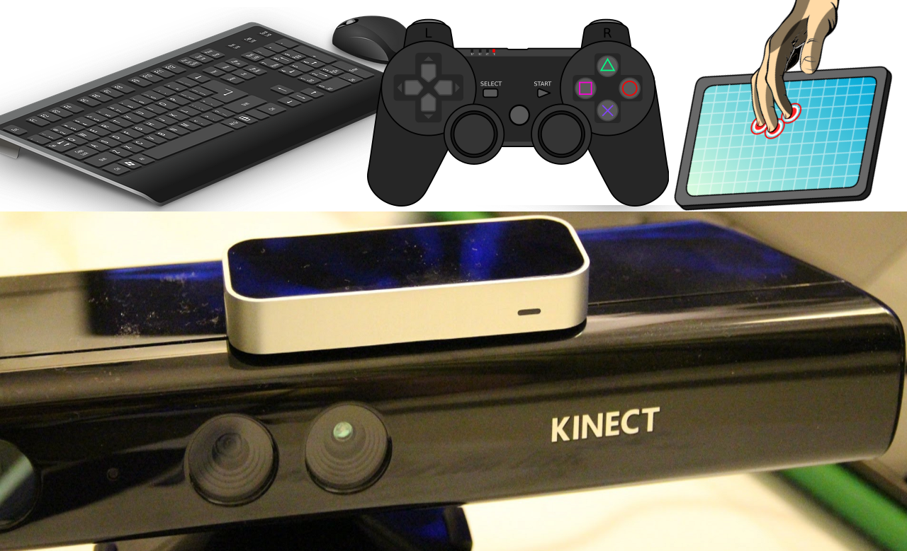
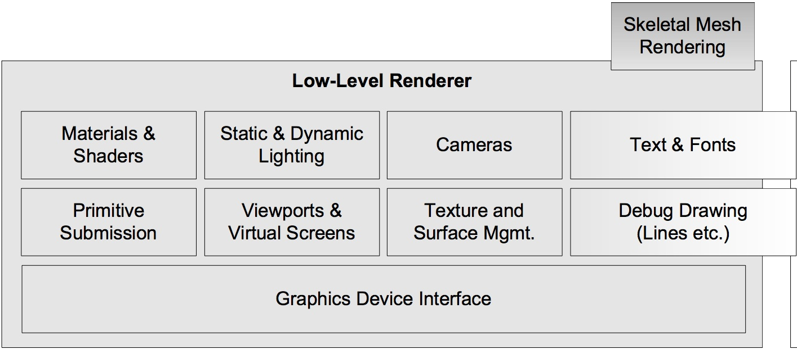
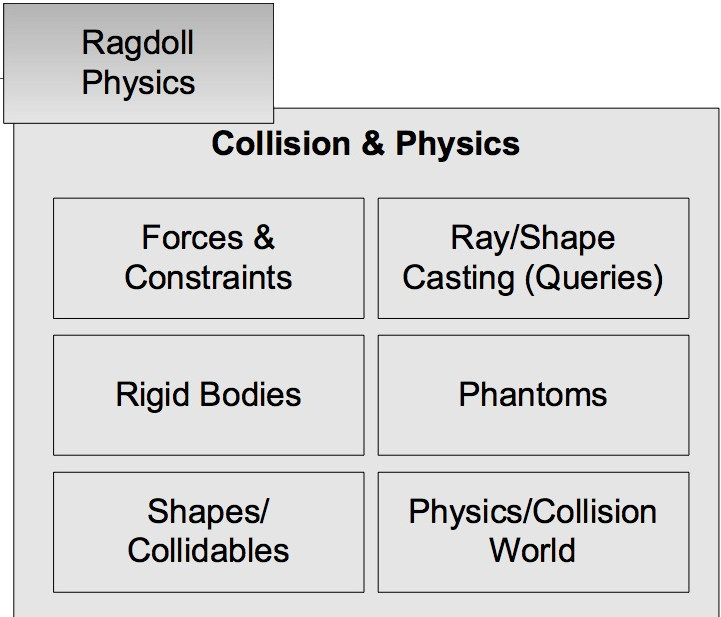
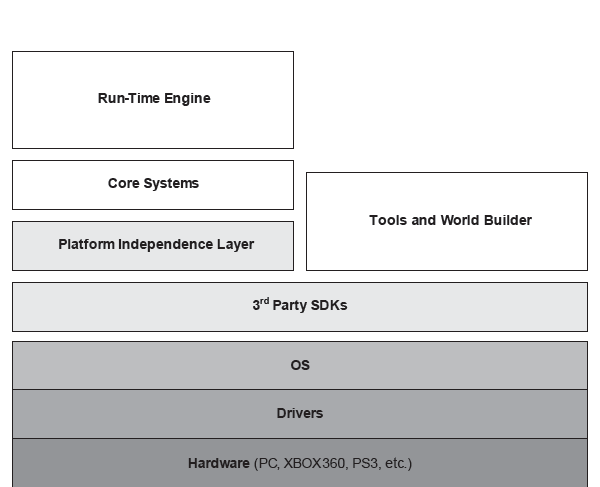
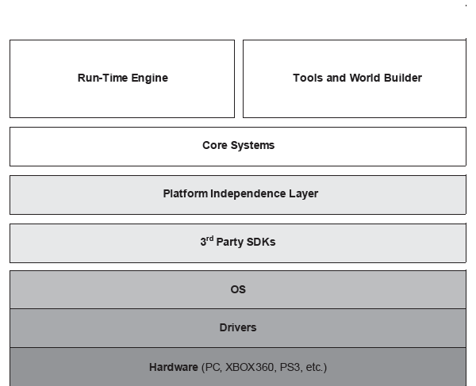
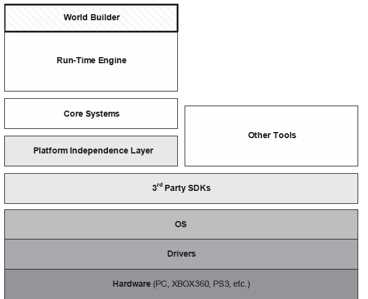

# Game Engine Architecture

## Introduction

---------------------
[Course Index](http://nikoladimitroff.github.io/Game-Engine-Architecture)

<table>
<tbody>
    <tr>
        <td>
            Nikola Dimitroff
        </td>
        <td>
            <a target="_blank" href="https://dimitroff.bg"><i class="fa fa-rss"></i></a>
            <a target="_blank" href="mailto:nikola@dimitroff.bg"><i class="fa fa-envelope-o"></i></a>
            <a target="_blank" href="https://github.com/nikoladimitroff"><i class="fa fa-github"></i></a>
            <a target="_blank" href="https://twitter.com/nikoladimitroff"><i class="fa fa-twitter"></i></a>
        </td>
    </tr>
    <tr>
        <td>
            Alexander Angelov
        </td>
        <td>
            <a target="_blank" href="mailto:aleksandar.angelovv@gmail.com"><i class="fa fa-envelope-o"></i></a>
            <a target="_blank" href="https://github.com/Alekssasho"><i class="fa fa-github"></i></a>
            <a target="_blank" href="https://twitter.com/Alekssasho"><i class="fa fa-twitter"></i></a>
        </td>
    </tr>
    <tr>
        <td>
            Viktor Ketipov
        </td>
        <td>
            <a target="_blank" href="mailto:info@kipiinteractive.com"><i class="fa fa-envelope-o"></i></a>
            <a target="_blank" href="https://github.com/k1p1"><i class="fa fa-github"></i></a>
            <a target="_blank" href="https://twitter.com/xk1p1x"><i class="fa fa-twitter"></i></a>

        </td>
    </tr>
</tbody>
</table>

 

--- NEXT SLIDE ---

# Sanity check

We are recording, aren't we?

--- NEXT SLIDE ---

# What's this course about?

--- VERTICAL SLIDE ---

## Game development

* How does a game team look like?
* How does a commercially-successful game engine look like?
* Is Unreal Engine 4 *awesome*? (hint: yes, yes it is)
* How do you write code for games?

--- NEXT SLIDE ---

# Who should visit the course?

<!-- .element class="fragment" data-fragment-index="0" --> Programmers.

--- VERTICAL SLIDE ---

* We'll focus on programming
* <!-- .element class="fragment" data-fragment-index="0" --> We'll only spend some itty-bitty time discussing game design and content creation (they deserve a course of their own!)
* <!-- .element class="fragment" data-fragment-index="1" --> But you'll get to see how awesome UE4 is
* <!-- .element class="fragment" data-fragment-index="2" --> We'll make it hard to you

--- VERTICAL SLIDE ---

## Required knowledge

* OOP with C++
  - We'll review and extend some C++ concepts
* Data structures
* First-year math - analytical geometry, linear algebra, basic calculus

--- NEXT SLIDE ---

# Why do we do it?

* We like torturing people
* We'd love to see more game developers
* We think you might like it

--- VERTICAL SLIDE ---

## Shameless advertisement time

--- VERTICAL SLIDE ---

### Ubisoft

TBA: IMAGE

Ubisoft is the company behind

* Assassin's Creed
* Far Cry
* The Tom Clancy series
* The Division
* Rayman | Rabbids | Just Dance | Brothers in Arms | Call of Juarez | Heroes | Watchdogs | Settlers | Anno | ...

--- VERTICAL SLIDE ---

### Ubisoft Sofia

TBA: IMAGE

* 230+ employees
* All production teams on-site - programming to design to art
* Leading AC: Liberation and AC: Rogue
* But also AC: Origins, The Division, Beyond Good And Evil 2, Skull & Bones

--- VERTICAL SLIDE ---

### Kipi Interactive

TBA: IMAGE

* Start-up working on a mobile top-down shooter
* Founded by Viktor
* Team of 10
* UE4-based

--- NEXT SLIDE ---

# Course contents

--- VERTICAL SLIDE ---

## Preliminaries

1. Introduction to the course
1. Fundamentals of computer games
1. A little bit of math
1. Architecture of a game

--- VERTICAL SLIDE ---

## Low-level systems

1. Fundamental game engine systems
1. Tools for debugging
1. Rendering engine theory and practice

--- VERTICAL SLIDE ---

## Advanced systems

1. Animation systems
1. Physics
1. UI
1. Audio
1. Gameplay
1. AI
1. Networking
1. Plugins for Unreal Engine 4

--- VERTICAL SLIDE ---

## Course structure

* 3 hours of theoretical game engine architecture
* 2 hours of Unreal Engine 4 goodness

--- VERTICAL SLIDE ---

## Grading

* 2 tests * 20% = 60%
* 1 course project * 40% = 40%

 
* Absence from lectures will not be punished
* Presence in lectures will not be rewarded (grade-wise)
* LIMITED OFFER, ONLY IN THE NEXT 15 WEEKS - Cheat once,
be banned to the ethereal world until next September!

--- VERTICAL SLIDE ---

## Communication

* However you see fit (email, social, GitHub)
* All of us are open to talking - make use of it
  - (and we are VERY open to beer and whiskey)
* We make mistakes, do say when you spot one

--- VERTICAL SLIDE ---

## Communication

* Homepage: [http://nikoladimitroff.github.io/Game-Engine-Architecture](http://nikoladimitroff.github.io/Game-Engine-Architecture)
  * I know, I know, we need to buy a domain
* Facebook group: [https://www.facebook.com/groups/1682570168689369/](https://www.facebook.com/groups/1682570168689369/)

--- VERTICAL SLIDE ---

## Literature

* [Game Engine Architecture, Jason Gregory, Lead in Naughty Dog (Uncharted)](http://www.gameenginebook.com/)
* [Effective C++, Scott Meyers](http://shop.oreilly.com/product/0636920033707.do)
* [Game coding complete, Mike McShaffry & David Graham](http://www.amazon.com/Game-Coding-Complete-Fourth-Edition/dp/1133776574)
* [*Game Programming Gems* series](http://www.satori.org/game-programming-gems/)
* [Collection of Game Development books](https://miloyip.github.io/game-programmer/game-programmer.svg)

--- NEXT SLIDE ---

# Game development is

* ...damn fun
* ...incredibly rewarding
* ...an art form

--- VERTICAL SLIDE ---

* ...incredibly time-consuming

--- VERTICAL SLIDE ---

* ...harder than mainstream programming [(ask SpaceX)](http://www.fastcompany.com/3031512/why-spacex-and-other-non-gaming-companies-are-scouting-talent-at-e3)

--- NEXT SLIDE ---

# A game dev team

* Developers1
  - Game
  - Engine
  - Tools
* Designers (Game designers, level designers)
* Artists (Concept Artists, Modelers, Animators, Writers, Composers, Actors)

1 Can be further specialized into subsystems.

--- NEXT SLIDE ---

# How is a game created?

--- VERTICAL SLIDE ---

Three phases:

* Pre-production
* Production
* Post-production

--- VERTICAL SLIDE ---

## Pre-production

* Idea - 'I wanna make a game MMO-fighter game!'
* Pitch - 'I can make this game make money because...'
* Concept & prototypes
  * 'This game will have...and the player will...and players will like it because...'
  * The birth of a game design document
  * Paper & pen to simple video game prototype

--- VERTICAL SLIDE ---

## Production

The actual development of the game. It is continuous and iterative process.
Changes happen all the time.

--- VERTICAL SLIDE ---

### Design <--> Programming

* <!-- .element class="fragment" data-fragment-index="0" --> Creative directors decide the overall direction
* <!-- .element class="fragment" data-fragment-index="1" --> Game designers come up with mechanics
* <!-- .element class="fragment" data-fragment-index="2" --> Gameplay programmers program the mechanics
* <!-- .element class="fragment" data-fragment-index="3" --> Engine programmers program the platform for the mechanics

 
* <!-- .element class="fragment" data-fragment-index="4" --> Level designers setup the environment
* <!-- .element class="fragment" data-fragment-index="5" --> Quest designers script missions
* <!-- .element class="fragment" data-fragment-index="6" --> Tool programmers program the instrumentarium for everyone

--- VERTICAL SLIDE ---

### (Visual) Art Production

* <!-- .element class="fragment" data-fragment-index="0" --> Art directors decide the overall direction
* <!-- .element class="fragment" data-fragment-index="1" --> Concept artists conceptualize the character / item / place
* <!-- .element class="fragment" data-fragment-index="2" --> Modelers build a 3D model
* <!-- .element class="fragment" data-fragment-index="3" --> Texturists / Lightning artists color it
* <!-- .element class="fragment" data-fragment-index="4" --> Animators and mocap team make it move

<!-- .element class="fragment" data-fragment-index="5" --> Repeat for other forms of art (sound, cinematics, storyline)

--- VERTICAL SLIDE ---

The game is constantly played, tested, changed

* don't break the build pls = waste of time for the entire studio

--- VERTICAL SLIDE ---

### Milestones

- First playable
- Alpha
- Beta
- Data freeze
- Gold master
- Day 0 patch?

--- VERTICAL SLIDE ---

## Post-production

- Maintenance
- DLCss
- Additional platforms

--- NEXT SLIDE ---

# Why make games as business?

TBA: To fill in with Stefan Duylgerov

--- NEXT SLIDE ---

# What's a game?

* <!-- .element class="fragment" data-fragment-index="0" --> A game is a structured form of play, usually undertaken for enjoyment and sometimes used as an educational tool.
* <!-- .element class="fragment" data-fragment-index="1" --> *'A series of interesting choices'* - Sid Meiers
* <!-- .element class="fragment" data-fragment-index="2" --> A
  * **soft-realtime**,
  * **interactive**,
  * **agent-based**
  * **simulation**

--- VERTICAL SLIDE ---

## Soft-realtime

* It is important to draw at 60fps (90 / 120 for VR)
* Nobody dies if you miss a frame or have a bug

--- VERTICAL SLIDE ---

## Interactive

* Respond to player input immediately

--- VERTICAL SLIDE ---

## Agent-based

* Player vs the world

--- VERTICAL SLIDE ---

## Simulation

* Photo-realistic graphics
* Believable physics
* Challenging AI

--- NEXT SLIDE ---

# Game engines

* A game engine is a framework for creating games that provides
common reusable functionality
* Often genre-specific
* Writing a engine from a scratch is a huge effort - *don't* do it
* <!-- .element class="fragment" data-fragment-index="0" --> Seriously - don't

--- VERTICAL SLIDE ---

<!-- .element class="fragment" data-fragment-index="0" --> For real though, don't build your own engine, build a game!

<!-- .element class="fragment" data-fragment-index="1" --> 

--- NEXT SLIDE ---

# Game Engine requirements

* Vary between genres
  - compare open-world games vs fighting games

--- VERTICAL SLIDE ---

--- VERTICAL SLIDE ---

* Performance
  - Frames per second >= 60 --> you only have 16 ms!
  - *Very easy* to mess up
  - *Very hard* to get right

--- VERTICAL SLIDE ---

* Graphics

--- VERTICAL SLIDE ---

* Player input

--- VERTICAL SLIDE ---

* Target hardware
    - Build once, run everywhere
    - Desktop platforms, consoles, mobile
    - STL?

--- VERTICAL SLIDE ---

* Artists-and-designer-friendly
    - Non-programmers should also be able to use the engine
    - Designers need editors and scripting languages
    - Artists need a sensible asset pipeline
    - Users shouldn't have to wait an eternity to load a file

--- VERTICAL SLIDE ---

--- NEXT SLIDE ---

# Engine structure

[Click me](resources/01.intro/runtime_arch.jpg)

--- VERTICAL SLIDE ---

* Hardware, OS, drivers and compilers
  - All platforms have an SDK of their own
  - Different compilers are needed (or better optimized) for specific platforms (i.e. MSVC is better than clang and gcc on Windows)

--- VERTICAL SLIDE ---

* Third party middleware
  - Standard library
  - Low-level graphics API - DirectX, OpenGL, Metal, GLES
  - Physics simulation - Havok, PhysX, Bullet

--- VERTICAL SLIDE ---

* Platform-independence layer = Standard library++

--- VERTICAL SLIDE ---

* Core systems

--- VERTICAL SLIDE ---

* Asset pipeline

--- VERTICAL SLIDE ---

* Rendering = Low-level primitives + Scene + VFX

--- VERTICAL SLIDE ---

--- VERTICAL SLIDE ---

* Physics

--- VERTICAL SLIDE ---

* Gameplay systems - Game object model vs. Software object model

--- VERTICAL SLIDE ---

* Game frontend

--- VERTICAL SLIDE ---

* Tools - separate vs. on-shared-framework vs. in-game
  - Separate

--- VERTICAL SLIDE ---

* On-shared-framework

--- VERTICAL SLIDE ---

* Stacked

--- NEXT SLIDE ---

# Game Engine Survey

## Unreal Engine 4

<iframe width="560" height="315" src="https://www.youtube.com/embed/0zjPiGVSnfI" frameborder="0" allowfullscreen></iframe>

--- VERTICAL SLIDE ---

## Pros

* Most sophisticated "free" engine on the market
* King of graphics
* *Awesome* architecture
* Huge community
* Open-source
* [A ton of your favourite games have been made with it](https://en.wikipedia.org/wiki/List_of_Unreal_Engine_games)
| Batman: Arkham Foo | Gears of War
| Mass Effect | Bioshock
| Borderlands | Tom Clancy
| Deus Ex
* [Unreal Dev Grants](https://www.unrealengine.com/unrealdevgrants)

--- VERTICAL SLIDE ---

## Cons

* *Insufficient* docs
* Lack of teaching materials
* *Steep* learning curve
* Being C++, compile times can become terrible

--- VERTICAL SLIDE ---

## Unity3D

--- VERTICAL SLIDE ---

## Pros

* [King in the mobile / indie department](https://en.wikipedia.org/wiki/List_of_Unity_games)
  - Hearthstone: Heroes of Warcraft
  - Kerbal Space Program
  - Ori and the Blind Forest
* Good looking graphics
* Easy to start
* *Very* quick iteration
* Huge community
* Much cheaper than UE4

--- VERTICAL SLIDE ---

## Cons

* Can't break in the AAA sector - rendering quality, extensibility, openness, tools seem lacking

--- VERTICAL SLIDE ---

## [Other notable engines](https://en.wikipedia.org/wiki/List_of_game_engines)

| Engine                   | Producer   | License      | Notable games                     |
| ------------------------ | ---------- | ------------ | --------------------------------- |
| CryEngine                | Crytek     | Subscription | Crysis, Evolve, Ryse: Son of Rome |
| BitSquid / Stingray      | Autodesk   | Subscription | Gauntlet, WH: Vermintide          |
| Gamemaker Studio         | YoYo Games | Crappy       | None interesting                  |
| Anvil / Dunia / Snowdrop | Ubisoft    | Proprietary  | Every Ubisoft Game                |
| Source                   | Valve      | Purchasable  | The Orange Box, Dota2, Titanfall  |
| RAGE                     | Rockstar   | Proprietary  | GTA                               |
| Gamebryo                 | Gamebase   | Purchasable  | Civ, Older Fallout / TSEV, Rift   |
| Creation                 | Bethesda   | Proprietary  | Skyrim, Fallout IV                |
| Frostbite                | EA         | Proprietary  | Battlefield, Dragon Age           |
| Ignite                   | EA         | Proprietary  | Sports (FIFA, Madden, UFC)        |

--- NEXT SLIDE ---

# Tools of the trade

* Source control - Git vs. Perforce
* IDE - Visual Studio vs. N/A
* Debuggers & Profilers - to be discussed later in the course

--- NEXT SLIDE ---

For the duration of the course you want to have this installed:

* VS 2019 Community Edition
* Git
* Unreal Engine 4 (no need to hurry, more details next time)
* [Optional] Blender & Audacity - if you plan on creating content

--- VERTICAL SLIDE ---

Reminder: The ~~hunger~~ course games are now on, make sure you are up to the challenge.
