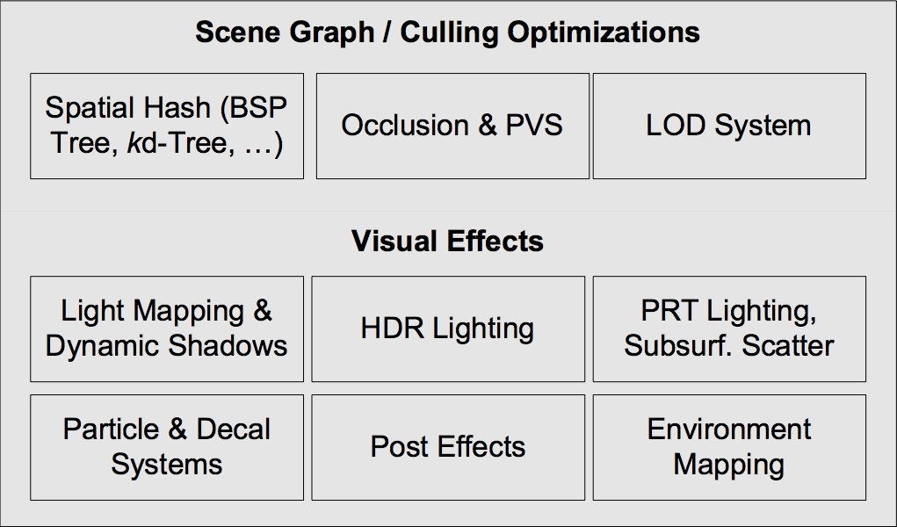

# Game Engine Architecture

## Introduction

---------------------
[nikoladimitroff.github.io/Game-Engine-Architecture](http://nikoladimitroff.github.io/Game-Engine-Architecture)

Nikola Dimitroff
<a href="mailto:nikola@dimitroff.bg"><i class="fa fa-envelope-o"></i></a>
<a href="https://github.com/nikoladimitroff"><i class="fa fa-github"></i></a>
<a href="https://dimitroff.bg"><i class="fa fa-rss"></i></a>

Dimitar Trendafilov
<a href="mailto:dimitar@coherent-labs.com"><i class="fa fa-envelope-o"></i></a>
<a href="https://github.com/dimitarcl"><i class="fa fa-github"></i></a>

--- NEXT SLIDE ---

# What's this course about?

### The secret holy order of illuminati game developers

(just kidding)

(we'll have to kill you if we tell you about it)

--- VERTICAL SLIDE ---

## Game development

* How does a game team look like?
* How does a commercially-succesful game engine look like?
* Is Unreal Engine 4 *awesome*? (hint: yes, yes it is)

--- NEXT SLIDE ---

# Who should visit the course?

* Pokemons and power rangers.

In their absence, we'll have to fill in the gaps with:
* DEVELOPERS
* DEVELOPERS
* DEVELOPERS

<iframe width="300" height="300" src="https://www.youtube.com/embed/Szl3yYJ7hl0?t=6s" frameborder="0" allowfullscreen></iframe>

--- VERTICAL SLIDE ---

* We'll focus on programming
* We'll only spend some itty-bitty time discussing game design and content creation (they deserve a course of their own!)
* But you'll get to see how awesome UE4 is.
* We'll make it hard to you - homeworks, tests and a course project. Cheaters will be *bannished to the ethereal world.*

--- VERTICAL SLIDE ---

## Required knowledge

* OOP with C++
    - Next week we'll review and extend some C++ concepts
* Data structures
* First-year math - analytical geometry, basic calculus

--- NEXT SLIDE ---

# Why do we do it?

* We like torturing people
* We also *kind of* like speaking to other game developers
* We'd love to see more game developers
  - Come visit the next [Sofia GameDev Meetup](https://www.facebook.com/groups/1666653146886762)

--- VERTICAL SLIDE ---

## Shameless advertisement time

* Coherent Labs makes UI middleware1
* We let people use HTML5 to build what's otherwise mundane, slow and error-prone
* We are platform-friendly - Windows, Mac OS X, Linux, WP8, iOS, Android, PS4, Xbox One
* We are engine-friendly - deep integrations into Unreal Engine 4 and Unity3D

    1 Awesome UI middleware

--- NEXT SLIDE ---

# Course contents

--- VERTICAL SLIDE ---

## Preliminaries

0. Introduction to the course
1. Fundamentals of computer games
2. A little bit of math
3. Architecture of a game

--- VERTICAL SLIDE ---

## Low-level systems

4. Fundamental game engine systems
5. Tools for debugging
6. Rendering engine theory and practice

--- VERTICAL SLIDE ---

## Advanced systems

7. Animation systems
8. Physics
9. UI
10. Audio
11. Gameplay
12. AI
13. Networking
14. Plugins for Unreal Engine 4

--- VERTICAL SLIDE ---

## Course structure

* 2 hours of theoretical game engine architecture
* 2 hours of Unreal Engine 4 goodness

--- VERTICAL SLIDE ---

## Grading

* 2 tests * 15% = 30%
* 2 homeworks * 15% = 30%
* 1 preliminary course project defense * 10% = 10%
* 1 Course project * 40% = 40%
* Several review questions per lecture * 1% = `numberOfCorrectAnswers`%
* Absence from lectures will not be punished
* Presence in lectures will not be rewarded (grade-wise)
* LIMITTED OFFER, ONLY IN THE NEXT 15 WEEKS - Cheat once,
be banned to the ethereal world until next September!

--- VERTICAL SLIDE ---

## Literature

* [Game Engine Architecture, Jason Gregory, Lead in Naughty Dog (Uncharted)](http://www.gameenginebook.com/)
* [Effective C++, Scott Meyers](http://shop.oreilly.com/product/0636920033707.do)
* [Game coding complete, Mike McShaffry & David Graham](http://www.amazon.com/Game-Coding-Complete-Fourth-Edition/dp/1133776574)
* [*Game Programming Gems* series](http://www.satori.org/game-programming-gems/)

--- NEXT SLIDE ---

# Game development is

* ...damn fun
* ...incredibly rewarding
* ...an art form

--- VERTICAL SLIDE ---

* ...incredibly time-consuming 

--- VERTICAL SLIDE ---

* ...harder than mainstream programming [(ask SpaceX)](http://www.fastcompany.com/3031512/why-spacex-and-other-non-gaming-companies-are-scouting-talent-at-e3)

--- NEXT SLIDE ---

# A game dev team

* Developers1
  - Game
  - Engine
  - Tools
* Designers (Game designers, level designers)
* Artists (Concept Artists, Modelers, Animators, Writers, Composers, Actors)

1 Can be further specialized into subsystems.

--- NEXT SLIDE ---

# How is a game created?

--- VERTICAL SLIDE ---

Three phases:

* Pre-production
* Production
* Post-production

--- VERTICAL SLIDE ---

## Pre-production

* Idea for a game with a brief description
* Pitch - Why do we need to develop this game?

--- VERTICAL SLIDE ---

* Concept
  - detailed description, budget, schedule, platforms, audience
  - concept art - mostly 2D art
  - prototypes of specific gameplay mechanics / game features

--- VERTICAL SLIDE ---

* Game design document
  - all of the above
  - updated during the production with more fine-grained details

--- VERTICAL SLIDE ---

* Prototype
  - proof of concept
  - vertical slice of the game, show the core (all) of the gameplay
  - answers whether the game will be fun
  - whether a technical challenge can be solved, i.e. 10000 avatars in a 1x1 km
    world

--- VERTICAL SLIDE ---

## Production

The actual development of the game. It is continous and iterative process.
* the game is constantly changing

--- VERTICAL SLIDE ---

### Game design

* Game designers / programmers create and program the gameplay
  - refine the gameplay
  - fill the game story

--- VERTICAL SLIDE ---

### Art Production

* models
* levels
* animations
* audio
* UI

--- VERTICAL SLIDE ---

* 3D Models and levels start as 2D concept art
* After the concept art is "final"
  - modelers create 3D models
  - texturists create and apply textures to make the model visible
  - animators create the skeleton of the model and make it live
* Level designers use the models and create levels

--- VERTICAL SLIDE ---

* Developers
  - create features/systems to facilitate the gameplay
  - create tools to help designers be more productive
  - make sure that the game can simulate a whole city, draw every grain of sand
    on the beach, every drop of rain, while your ride on a race course

--- VERTICAL SLIDE ---

The game is constantly played, tested, changed

  - no build = waste of time for the entire studio

--- VERTICAL SLIDE ---

### Milestones

- First playable
- Alpha
- Code freeze
- Beta
- Code release
- Gold master

--- VERTICAL SLIDE ---

## Post-production

- Maintenance
- DLCs
- Additional platforms

--- NEXT SLIDE ---

# What's a game?

--- VERTICAL SLIDE ---

## Soft-realtime system

* it is important to draw at 60fps (90, 120 for VR)

--- VERTICAL SLIDE ---

## Interactive

* respond to player input NOW!

--- VERTICAL SLIDE ---

## Agent-based

* player vs the world

--- VERTICAL SLIDE ---

## Simulation

* photo-releastic graphics
* believable physics
* challenging AI

--- NEXT SLIDE ---

# A game engine

* A game engine is a framework for creating games that provides
common reusable functionality
* Often genre-specific
* Writing a engine from a scratch is a huge effort - *don't* do it

--- NEXT SLIDE ---

# Game Engine requirements

* Vary between genres
  - compare open-world games vs fighting games

--- VERTICAL SLIDE ---

--- VERTICAL SLIDE ---

* Performance
  - Frames per second >= 60 --> you only have 16 ms!
  - *Very easy* to mess up
  - *Very hard* to get right

--- VERTICAL SLIDE ---

* Graphics

--- VERTICAL SLIDE ---

* Player input

--- VERTICAL SLIDE ---

* Target hardware
    - Build once, run everywhere
    - Desktop platforms, consoles, mobile
    - STL?

--- VERTICAL SLIDE ---

* Artists-and-designer-friendly
    - Non-programmers should also be able to use the engine
    - Designers need editors and scripting languages
    - Artists need a sensible asset pipeline

--- VERTICAL SLIDE ---

    
--- NEXT SLIDE ---

# Engine structure

[Click me](resources/01.intro/runtime_arch.jpg)

--- VERTICAL SLIDE ---

* Hardware, OS, drivers and compilers
    - All platforms have an SDK of their own
    - Different compilers are needed (or better optimized) for specific platforms (i.e. MSVC is better than clang and gcc on Windows)

--- VERTICAL SLIDE ---

* Third party middleware
    - Standard library
    - Low-level graphics API - DirectX, OpenGL, Metal, GLES
    - Physics simulation - Havok, PhysX, Bullet
    - UI - Coherent *, Scaleform, Iggy

--- VERTICAL SLIDE ---

* Platform-indepedence layer = Standard library++

--- VERTICAL SLIDE ---

* Core systems

--- VERTICAL SLIDE ---

* Asset pipeline

--- VERTICAL SLIDE ---

* Rendering = Low-level primitives + Scene + VFX

--- VERTICAL SLIDE ---

--- VERTICAL SLIDE ---

* Physics

--- VERTICAL SLIDE ---

* Gameplay systems - Game object model vs. Software object model

--- VERTICAL SLIDE ---

* Game frontend

--- VERTICAL SLIDE ---

* Tools - separate vs. on-shared-framework vs. in-game

--- NEXT SLIDE ---

# Game Engine Survey

## Unreal Engine 4

<iframe width="560" height="315" src="https://www.youtube.com/embed/0zjPiGVSnfI" frameborder="0" allowfullscreen></iframe>

--- VERTICAL SLIDE ---

## Pros

* Most sophisticated "free" engine on the market
* King of graphics
* *Awesome* architecture
* Huge community
* "Open-source"
* [A ton of your favourite games have been made with it](https://en.wikipedia.org/wiki/List_of_Unreal_Engine_games)
| Batman: Arkham Foo | Gears of War
| Mass Effect | Bioshock
| Borderlands | Tom Clancy
| Deus Ex
* [Unreal Dev Grants](https://www.unrealengine.com/unrealdevgrants)

--- VERTICAL SLIDE ---

## Cons

* *Insufficient* docs
* Lack of teaching materials
* *Steep* learning curve
* Being C++, compile times can become terrible

--- VERTICAL SLIDE ---

## Unity3D

--- VERTICAL SLIDE ---

## Pros

* The best OKish engine
* Good looking graphics
* Easy to start
* *Very* quick iteration
* Huge community
* [King in the mobile / indie department](https://en.wikipedia.org/wiki/List_of_Unity_games)
  - Hearthstone: Heroes of Warcraft
  - Kerbal Space Program
  - Ori and the Blind Forest

--- VERTICAL SLIDE ---

## Cons

* Not AAA material
* Crappy architecture
* Bad performance on everything but mobile

--- VERTICAL SLIDE ---

## New contenders on the scene

[Lumberyard](https://aws.amazon.com/lumberyard/)

* Basically CryEngine
  - stunning graphics
* Free
* Source code access
* Integrated with AWS and Twitch

--- VERTICAL SLIDE ---

## [Other notable engines](https://en.wikipedia.org/wiki/List_of_game_engines)

| Engine              | Producer   | License      | Notable games                     |
| ------------------- | ---------- | ------------ | --------------------------------- |
| CryEngine           | Crytek     | Subscription | Crysis, Evolve, Ryse: Son of Rome |
| BitSquid / Stingray | Autodesk   | Subscription | Gauntlet, WH: Vermintide          |
| Gamemaker Studio    | YoYo Games | Crappy       | None interesting                  |
| Anvil / Snowdrop    | Ubisoft    | Proprietary  | Every Ubisoft Game                |
| Source              | Valve      | Purchasable  | The Orange Box, Dota2, Titanfall  |
| RAGE                | Rockstar   | Proprietary  | GTA                               |
| Gamebryo            | Gamebase   | Purchasable  | Civ, Older Fallout / TSEV, Rift   |
| Creation            | Bethesda   | Proprietary  | Skyrim, Fallout IV                |
| Frostbite           | EA         | Proprietary  | Battlefield, Dragon Age           |
| Ignite              | EA         | Proprietary  | Sports (FIFA, Madden, UFC)        |

--- NEXT SLIDE ---

# Tools of the trade

* Source control - Git vs. Perforce
* IDE - Visual Studio vs. NA
* Debuggers & Profilers - to be discussed later in the course

--- VERTICAL SLIDE ---

For the duration of the course you might want to have this installed:

* VS 2015 (see [Dreamspark](http://elms.fmi.uni-sofia.bg/))
* Git
* Unreal Engine 4
* [Optional] Blender & Audacity - if you plan on creating content
