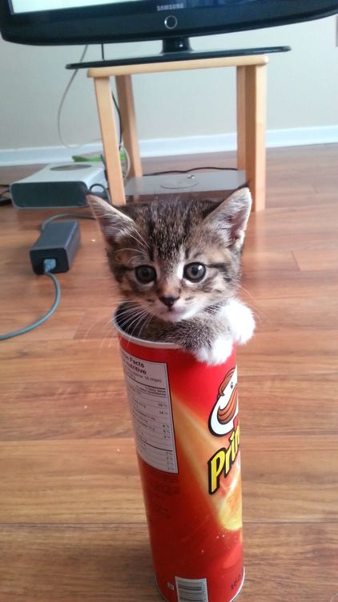

# Game Engine Architecture

## Introduction to UE4

---------------------
[nikoladimitroff.github.io/Game-Engine-Architecture](http://nikoladimitroff.github.io/Game-Engine-Architecture)

Nikola Dimitroff
<a href="mailto:nikola@dimitroff.bg"><i class="fa fa-envelope-o"></i></a>
<a href="https://github.com/nikoladimitroff"><i class="fa fa-github"></i></a>
<a href="https://dimitroff.bg"><i class="fa fa-rss"></i></a>

Dimitar Trendafilov
<a href="mailto:dimitar@coherent-labs.com"><i class="fa fa-envelope-o"></i></a>
<a href="https://github.com/dimitarcl"><i class="fa fa-github"></i></a>

--- NEXT SLIDE ---

## Review

What are Scaleform and Iggy?

<!-- .element class="fragment" data-fragment-index="0" --> UI middleware solutions by Autodesk and Rad Game Tools respectively

--- VERTICAL SLIDE ---

## Review

What are the 3 major phases of a game's creation?

<!-- .element class="fragment" data-fragment-index="0" --> Pre-production, production, post-production

--- NEXT SLIDE ---

## Contents

1. [UE4 requirements](#/requirements)
1. [Setting up the engine](#/setup)
1. [Game structure](#/game-structure)
1. [Module overview](#/modules-overview)
1. [Coding standard](#/coding-standard)

--- NEXT SLIDE ---

Epic Games use cats in their presentations and since today's topic is UE4...


--- NEXT SLIDE ---

<!-- .slide: id="requirements" -->

## UE4 for our purposes

* We'll *only* run UE4 from source.
* We'll work in the latest stable version.
* Upgrading the engine whenever a new patch comes out is
your permament homework.

--- VERTICAL SLIDE ---

## UE4 for our purposes

UE4 requires some not-so-modest hardware.

* 8 GB of RAM
* a DX11 compatible video card
* Quad-core x86 CPU.

--- VERTICAL SLIDE ---

## UE4 for our purposes

As for software:

* We'll use VS2015 and Win10.
* You can also use any Windows above 7.
* Or Mac 10.9.2+ and XCode.
* If you want Linux, see [here](https://wiki.unrealengine.com/Building_On_Linux).

--- NEXT SLIDE ---

<!-- .slide: id="setup" -->

## Setting up UE4

1. Create a github account if you don't already own one.
2. Go to [unrealengine.com](http://unrealengine.com)
and sign up.
3. Go to your profile and enter your github name.
4. Wait until you receive an email notifying you that you've
been added to the [EpicGames' organization in github.](https://github.com/EpicGames)

--- VERTICAL SLIDE ---

## Repo structure

* `master` contains the latest changes *<-- Pull requests go here*
* `promoted` contains stable-ish versions of `master`
* `release` contains only stable versions - previews and finals
* Each version is tagged and branched

--- VERTICAL SLIDE ---

## Setting up UE4

Open cmd and run:

```cmd
git clone git@github.com:EpicGames/UnrealEngine.git
cd UnrealEngine
git checkout <latest-stable-version>
Setup.bat
GenerateProjectsFiles.bat
start UE4.sln
```
(replace `.bat` with `.sh` if you are running in bash/sh/zsh)

More instructions [here](https://github.com/EpicGames/UnrealEngine)

--- VERTICAL SLIDE ---

**IMPORTANT:** Clone UE4 near the root of your drive on Windows and
not 10 levels deep!

`setup.bat` takes a lot of time depending on your machine
and network connection but usually less than an hour.


--- VERTICAL SLIDE ---

### Building

[Optional] Disable the unity build - open
*/Engine/Saved/UnrealBuildTool/BuildConfiguration.xml*
and copy this inside:

```xml
<?xml version="1.0" encoding="utf-8" ?>
<Configuration xmlns="https://www.unrealengine.com/BuildConfiguration">
    <BuildConfiguration>
      <bUseUnityBuild>false</bUseUnityBuild>
    </BuildConfiguration>
</Configuration>
```

--- VERTICAL SLIDE ---

### Definition: Unity build

The practice of putting all source code into a single
master file before compilation.

--- VERTICAL SLIDE ---

1. Open VS / XCode. Select the *Developer Editor* configuration
and x64 platform.
1. Build the solution.
1. Go for a coffee with friends as you just made your computer unusable
for the next 1 to 4 hours while the engine is building.

--- NEXT SLIDE ---

### Running the engine for the first time

* Start from VS as usual (F5 / Ctrl + F5)
* Create a new project.
* *Choose your starter* template, build and run it!
    - but not before you wait 30 minutes more for shader compilation


--- VERTICAL SLIDE ---

1. General Editor UI
1. Scene editor
1. Content browser
1. Plugins
1. Settings
1. Tutorials

--- NEXT SLIDE ---

## Unreal is huge!


--- VERTICAL SLIDE ---

## Unreal is huge!

* Hundreds of modules
* 5k directories
* 40k files
* Millions LOC
* Who-knows-how-many tools
* Centuries of man-years

--- VERTICAL SLIDE ---

## Unreal is huge!

* Initially released in 1998
* It currently supports all desktop, console and mobile platforms
    - \+ WebGL (experimental)
* Handcrafted by Master Tim Sweeny

<!-- .element class="fragment" data-fragment-index="0" --> 

<!-- .element class="fragment" data-fragment-index="0" --> * Worship your new master!

--- VERTICAL SLIDE ---

## Know thy tools

<del>UE4</del> All code is bad & buggy

* VS Search-in-files (<kbd>Ctrl</kbd> + <kbd>Shift</kbd> + <kbd>F</kbd>)
* VS Navigate-to (<kbd>Ctrl</kbd> + <kbd>,</kbd>)
* [VS Chromium](http://chromium.github.io/vs-chromium/) (<kbd>Ctrl</kbd> + <kbd>Shift</kbd> + <kbd>;</kbd>)
* Use Go-To-Source on your own risk (<kbd>F12</kbd>)
* VS Outlining
* There's also
[UnrealVS](https://docs.unrealengine.com/latest/INT/Programming/Development/VisualStudioSetup/UnrealVS/index.html)

--- VERTICAL SLIDE ---

## For example...

*Launch[YourPlatform].cpp* contains the engine's `main` (e.g. *LaunchWindows.cpp*)

If you were to remove all the details in it, you'll get something like this:

```cpp
int main()
{
    FEngineLoop GEngineLoop;
    GEngineLoop.Init();
    while (!GIsRequestingExit)
    {
        GEngineLoop.Tick();
    }
    GEngineLoop.Exit();
}
```

--- VERTICAL SLIDE ---

## Tips for starting

* Don't expect to learn everything! Even master Tim doesn't!
* UE4 is well-architectured. In time, you'll see that searching
for unknown features is pretty straightforward (unless you
are searching for core Editor features).

--- NEXT SLIDE ---

### Solution structure

* All projects are in the same solution
* Project files are all generated
* If you need to regenerate the solution,
right-click the uproject in Explorer / Finder
    - Can also be achieved via *GenerateProjectFiles.bat*
    for more options
* Ignore the 'Project is out of date' warning
* Do not create new C++ files from inside VS!

--- VERTICAL SLIDE ---

### Solution configurations

* Configurations follow the pattern *[Optimization Level] [Target]*
* Optimization levels:
    - Debug & DebugGame
    - Development
    - Shipping
    - Test
* Targets:
    - None
    - Editor
    - Client
    - Server

--- VERTICAL SLIDE ---

### Definition: Cooking

The process of optimizing the game's content for
the target platform.


--- NEXT SLIDE ---

<!-- .slide: id="game-structure" -->

## Game structure

The engine, plugins and games share the same structure

| Directory | Description                                                  |
| --------- | ------------------------------------------------------------ |
| /Binaries | Executables & shared libraries                               |
| /Build    | Helper files for building the engine. Mostly batch files.    |
| /Config   | Configuration files.                                         |
| /Content  | Assets. The editor directory is shared between all projects. |

--- VERTICAL SLIDE ---

...

| Directory         | Description                             |
| ----------------- | --------------------------------------- |
| /DerivedDataCache | Cached content data files (Engine only) |
| /Intermediate     | Temporary build products                |
| /Plugins          | Shared and project specific plug-ins    |
| /Saved            | Autosaves, logs, screenshots, etc.      |
| /Source           | Source code for all the things!         |

--- VERTICAL SLIDE ---

Every Unreal project and the engine itself is separated into ***modules***.

* A module is a collection of code that implements some functionality.
UBT builds each module as a separate library.
* All code must belong to a module.
* A game / plugin must contain at least one module.
* Creating a project also creates a module with the same name.
* Your C++ code goes to *Source/[ModuleName]*.

--- VERTICAL SLIDE ---

### Game structure

Several files are essential for each project:

| File                                        | Description                                                              |
| ------------------------------------------- | ------------------------------------------------------------------------ |
| *[GameName].uproject*                       | Stores general info - the engine version for the game, module structure. |
| *Source/[GameName].Target.cs*               | Used to setup the build environment for the *game*                       |
| *Source/[GameName]Editor.Target.cs*         | Used to setup the build environment for the *game* in the Editor         |
| *Source/[ModuleName]/[ModuleName].Build.cs* | Used to setup the build environment for each *module*                    |

And don't forget *[GameName]Client.Target.cs* and *[GameName]Server.Target.cs*

--- VERTICAL SLIDE ---

#### Game descriptor

```js
{
    "FileVersion": 3,
    "EngineAssociation": "{057B6751-43BC-4BA7-0068-58824477289A}",
    "Category": "",
    "Description": "",
    "Modules": [
        {
            "Name": "SusiShooter",
            "Type": "Runtime",
            "LoadingPhase": "Default"
        }
    ]
}
```

--- VERTICAL SLIDE ---

#### Target rules

```cs
public class SusiShooterTarget : TargetRules
{
    public SusiShooterTarget(TargetInfo Target)
    {
        Type = TargetType.Game;
    }
    public override void SetupBinaries(TargetInfo Target,
        ref List<UEBuildBinaryConfiguration> OutBuildBinaryConfigurations,
        ref List<string> OutExtraModuleNames)
    {
        OutExtraModuleNames.Add("SusiShooter");
    }
    public override void SetupGlobalEnvironment(TargetInfo Target,
        ref LinkEnvironmentConfiguration OutLinkEnvironmentConfiguration,
        ref CPPEnvironmentConfiguration OutCPPEnvironmentConfiguration)
    {}
}
```

--- VERTICAL SLIDE ---

#### Module rules

```cs
public class SusiShooter : ModuleRules
{
    public SusiShooter(TargetInfo Target)
    {
        PublicDependencyModuleNames.AddRange(new string[]
            { "Core", "CoreUObject", "Engine", "InputCore" }
        );
        PrivateDependencyModuleNames.AddRange(new string[] { "UMG" });
        PrivateIncludePaths.Add("/Path/To/Susi/Api");
    }
}
```

--- VERTICAL SLIDE ---

Plugins have the exact same structure - except their project
file is *[PluginName].uplugin* instead of *[GameName].uproject*.

--- NEXT SLIDE ---

### To git or not to git

When making your own projects, you only need the following files
and directories under source control:

* */Config*
* */Content*
* */Source*
* [GameName].uproject

It's dangerous to go alone! Take this
[*.gitignore*](https://gist.github.com/nikoladimitroff/c29f766a6a8ee59c3ba2).

--- NEXT SLIDE ---

<!-- .slide: id="modules-overview" -->

## Modules

* Modules are UE4's custom libraries.
* They can be linked either statically or dynamically.
* They can be delay loaded.
* They have a well-defined interface for (de)initialization.
* The engine detects modules dynamically and there are plenty
of dependency injection opportunities

--- VERTICAL SLIDE ---

...
Modules improve reusability...



--- VERTICAL SLIDE ---

...
* Extensibility
* Maintainability
* Decoupling
* Efficiency
* Iteration time

--- VERTICAL SLIDE ---

Modules are the key to having developing the engine,
all games and all plugins *look* and *feel* identical.

--- NEXT SLIDE ---

## Engine modules breakdown

All core modules are located under */Engine/Source/* and
placed into one of these categories<sup>1</sup>:

| Type       | Purpose                             |
| ---------- | ----------------------------------- |
| Developer  | Usable in the Editor & Programs     |
| Editor     | Usable in the Editor only           |
| Runtime    | Usable everywhere                   |
| ThirdParty | External code from other companies  |
| Plugins    | Extensions for Editor and / or Game |

<sup>1</sup> Plugins are stored in */Engine/Plugins* and */[Game]/Plugins*.

--- VERTICAL SLIDE ---

## Module dependencies

* Runtime modules may not depend on Editor / Developer
* Plugins may not depend on other plugins


--- VERTICAL SLIDE ---

## Some important modules

| Module         | Purpose                                                                              |
| -------------- | ------------------------------------------------------------------------------------ |
| Core           | Basically STL + window management                                                    |
| CoreUObject    | Implements the entire UObject subsystem                                              |
| Engine         | Game systems & the Engine framework. The Bluprint VM                                 |
| Renderer       | Renders the world                                                                    |
| RenderCore     | Provides low-level rendering helpers                                                 |
| RHI            | Rendering HW Interface - an abstraction over the hardware device (DX, OpenGL, etc.)  |
| Slate          | Provides low-level UI functionality                                                  |
| UMG            | Provides high-level (and actually usable) UI functionality                           |
| TargetPlatform | Platform abstraction layer <--- Porting CPP Code 101                                 |
| UnrealEd       | Implements the Editor                                                                |

--- VERTICAL SLIDE ---

## And some cool modules

| Module                    | Purpose                                       |
| ------------------------- | --------------------------------------------- |
| Analytics                 | Collects usage statistics from Editor & games |
| GameLiveStreaming         | Twitch Streaming                              |
| HeadMountedDisplay        | HMD Support API (Oculus, etc.)                |
| JsonUtilities & XmlParser | Handle Json & XML files                       |


--- VERTICAL SLIDE ---

As of 4.10.4, there are **298** modules!

Before implementing a new feature by hand, check whether it's not already there

P.S. For anyone curious, here's how to count the modules:

```bash
grep -r "public IModuleInterface" /Engine/Source/ | wc -l
```

--- NEXT SLIDE ---

<!-- .slide: id="coding-standard" -->

# Coding standard

* There are few really important classes
    - `UObject` is the father of all; provides reflection and garbage collection
    - `AActor` is the parent of everything placeable in the world. Derived from `UObject`
    - `SWidget` is the parent of slate widgets

--- VERTICAL SLIDE ---

* Each type must be prefixed

| Prefix | Meaning                       |
| ------ | ----------------------------- |
| IFoo   | An interface (abstract class) |
| UFoo   | Foo derives from UObject      |
| AFoo   | Foo derives from AActor       |
| SFoo   | Foo derives from SWidget      |
| TFoo   | A template class              |
| FFoo   | Plain old C++ class           |

--- VERTICAL SLIDE ---

* Naming
    - All types must be prefixed but not the files they reside in
    - Strive for one class per file
    - ***All*** variables, methods and classes are in PascalCase
    - ***except*** for boolean variables which are prefixed by lowercase b - `bIsKittenCute`
    - Prefer readability over saving keystrokes

--- VERTICAL SLIDE ---

* Prefer UE4's typedefs  (`uint8`,  `int32`, etc) to standard integer types
* Braces go on a new line and are required around loops and if-s
* Tabs for indentation
* Pointer and references are

```cpp
// Declared like this
FKitten* MrBigglesworth;
FDog& Lucky;
// Not like this
FDog& TheBaskervilleHound;
```

--- VERTICAL SLIDE ---

* The engine does not use namespaces but they are fine to be used.
* Speaking of things which can be used:
    - Ranged for-loops
    - Lambdas
    - The `auto` keyword

--- NEXT SLIDE ---

Congratulations, comrade, you survived!

Here are a few things to do until the next week:

* Meet the community
  - [Forum](https://forums.unrealengine.com/)
  - [Answer hub](https://answers.unrealengine.com/index.html)
  - [Wiki](https://wiki.unrealengine.com/Main_Page)
  - [Video tutorials](https://www.youtube.com/watch?v=QMsFxzYzFJ8&list=PLZlv_N0_O1gaCL2XjKluO7N2Pmmw9pvhE)
  - [Roadmap](https://trello.com/b/gHooNW9I/ue4-roadmap)
  - [Facebook user group](https://www.facebook.com/groups/ue4devs/?fref=ts)

--- VERTICAL SLIDE ---

...
* Download and build UE4 ASAP!
* Play with the [provided samples!](https://docs.unrealengine.com/latest/INT/Resources/SampleGames/index.html)
* Think about what project you want to deliver at the end of the course.

--- NEXT SLIDE ---

Any questions?


