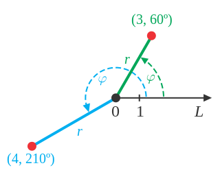
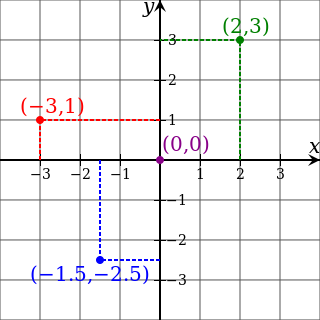
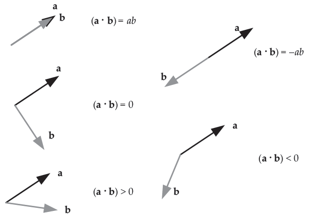
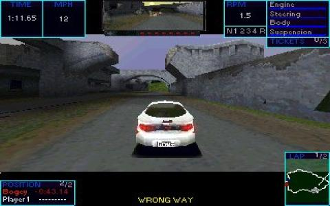
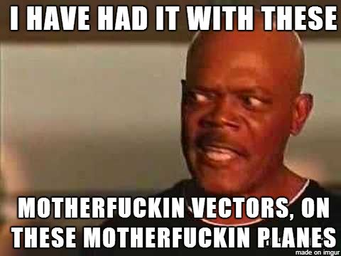

# Game Engine Architecture

## Math

---------------------
[Course Index](http://nikoladimitroff.github.io/Game-Engine-Architecture)

<div class="authors-section">
<table>
<tbody>
    <tr>
        <td>
            Nikola Dimitroff
        </td>
        <td>
            <a target="_blank" href="https://dimitroff.bg"><i class="fa fa-rss"></i></a>
            <a target="_blank" href="mailto:nikola@dimitroff.bg"><i class="fa fa-envelope-o"></i></a>
            <a target="_blank" href="https://github.com/nikoladimitroff"><i class="fa fa-github"></i></a>
            <a target="_blank" href="https://twitter.com/nikoladimitroff"><i class="fa fa-twitter"></i></a>
        </td>
    </tr>
    <tr>
        <td>
            Alexander Angelov
        </td>
        <td>
            <a target="_blank" href="mailto:aleksandar.angelovv@gmail.com"><i class="fa fa-envelope-o"></i></a>
            <a target="_blank" href="https://github.com/Alekssasho"><i class="fa fa-github"></i></a>
            <a target="_blank" href="https://twitter.com/Alekssasho"><i class="fa fa-twitter"></i></a>
        </td>
    </tr>
    <tr>
        <td>
            Viktor Ketipov
        </td>
        <td>
            <a target="_blank" href="mailto:info@kipiinteractive.com"><i class="fa fa-envelope-o"></i></a>
            <a target="_blank" href="https://github.com/k1p1"><i class="fa fa-github"></i></a>
            <a target="_blank" href="https://twitter.com/xk1p1x"><i class="fa fa-twitter"></i></a></p>
        </td>
    </tr>
</tbody>
</table>
</div>

<div class="companies-section">
<a class="ubisoft-logo" href="https://ubisoft.com" target="_blank"></a>
<br>
<a class="kipi-logo" href="http://kipiinteractive.com" target="_blank"></a>
</div>

--- NEXT SLIDE ---

# Sanity check

We are recording, aren't we?


--- NEXT SLIDE ---

## Review

What's PIMPL?

<!-- .element class="fragment" data-fragment-index="0" --> The pattern of publicly exposing only an interface,
implementing that interface in private code and exposing a `IFoo* CreateFoo()` function that creates the actual object.

--- VERTICAL SLIDE ---

## Review

UE4 has 4 types of strings. What are they and what's their purpose?

* <!-- .element class="fragment" data-fragment-index="0" --> `TCHAR*` - properly-encoded, null-terminated string
* <!-- .element class="fragment" data-fragment-index="1" --> `FString` - a standard string class
* <!-- .element class="fragment" data-fragment-index="2" --> `FText` - localized, immutable string, used for output
* <!-- .element class="fragment" data-fragment-index="3" --> `FName` - interned, immutable string, used for identification

--- VERTICAL SLIDE ---

## Review

What'a delegate?

<!-- .element class="fragment" data-fragment-index="0" --> A wrapper around callable thing(s).

--- NEXT SLIDE ---

## Contents

1. [Vectors](#/vectors)
1. [Matrices](#/matrices)
1. [Coordinate system changes](#/coordinate-system-changes)
1. [Quaternions](#/quaternions)
1. [Interpolation](#/interpolation)

--- NEXT SLIDE ---

Good math skills are invaluable when creating games.

<iframe width="400" height="300" src="https://www.youtube.com/embed/_GyFRMr4uf4" frameborder="0" allowfullscreen></iframe>


--- VERTICAL SLIDE ---

1. How do you create a cinematic scene in which the camera
spirals outward of the protagonist?
1. How do you decide not to draw roofs and walls in top-down
games?
1. How do you compute the direction of a ball hit by footballer?

<!-- .element class="fragment" data-fragment-index="0" --> Spoiler alert: Math

--- VERTICAL SLIDE ---

In case you didn't think that the books in the first lecture were enough:

[Mathematics for 3D Game programming...](http://www.amazon.com/Mathematics-Programming-Computer-Graphics-Edition/dp/1435458869)

--- NEXT SLIDE ---

<!-- .slide: id="vectors" -->

## Definition: Coordinate system

A system which uniquely determines the position and rotation of
a geometric element in a given space.

Also known as a *frame of reference*.

--- VERTICAL SLIDE ---

## Types

Polar Vs. Carthesian




--- VERTICAL SLIDE ---

* The carthesian system is defined by its origin and a set of perpendicular axes
* The principal axes are called basis vectors and are denoted with $(i, j, k)$ or $(e_1, e_2, e_3)$
* Usually the x and z are parallel to the floor and y is perpendicular
    - x is the *abscissa*, z is the *applicate*, y is the *ordinate*

--- VERTICAL SLIDE ---


* The handedness of a system does not change the mathematics
* Usually a left-handed system is used as this corresponds to the depth of the scene

--- NEXT SLIDE ---

## Definition: Vector

Algebraically: a tuple of real numbers

Geometrically: a geometric object with magnitude and direction that shows displacement

--- VERTICAL SLIDE ---

The coordinates of a point in a carthesian coordinate system is a vector
which means we can describe all geometric objects with vectors alone.

Usually, points are vectors are represented with the same data structure.
This does not mean they are perfectly equivalent - points are absolute and
indepedent of the coordinate system. Vectors are relative and depend on the
coordinate system.

--- VERTICAL SLIDE ---

Note on convention - assume the following notations on all slides below:

$$
p = (x, y, z) \\\\
q = (u, v, w)
$$

--- VERTICAL SLIDE ---

### Vector operations

$$
(x, y, z)\pm(u, v, w) = (x \pm u,y \pm v,z \pm w) \\\\
c(x, y, z)=(cx, cy, cz) \\\\
|(x, y, z)| = \sqrt{x^2 + y^2 + z^2} \\\\
dist(p, q) = |p - q|
$$

--- VERTICAL SLIDE ---

Square roots are slow! Try to use the squared length
instead as much as possible:

$$
|(x, y, z)|^2 = x^2 + y^2 + z^2 \\\\
distSquared(p, q) = |p - q|^2
$$

```cpp
if (distSquared(player, enemy) < MAX_PLAYER_DISTANCE_SQUARED)
    enemy.attack(player);
```

--- VERTICAL SLIDE ---

### Definition: Normalized vector

A vector with unit length is called normalized.
They are useful when one only cares
about the direction the vector is pointing to.

The process of converting a vector to a normalized vector
is called *normalization*.

$$
n = {a \over |a| }
$$

--- VERTICAL SLIDE ---

### Definition: Normal vector

A vector that is perpendicular to a given object
(e.g. plane)

* Normal vectors are often normalized but don't need to be.
* Every vector is a normal to some object.

--- VERTICAL SLIDE ---


--- NEXT SLIDE ---

## Dot product

Algebraically:

$$
(x, y, z) \cdot (u, v, w) = xu + yv + zw
$$

Geometrically:

$$
p \cdot q = |p||q|\cos(\theta)
$$

--- VERTICAL SLIDE ---

### Properties

* Comutative $p \cdot q = p \cdot q$
* Distributive $p \cdot (q \pm r) = p \cdot q \pm p \cdot r$

--- VERTICAL SLIDE ---

### Usage

$$
p \perp q \iff \theta = {k\pi \over 2} \iff p \cdot q = 0 \\\\
p \parallel q \iff \theta = k\pi \iff p \cdot q = |p||q| \\\\
$$


--- VERTICAL SLIDE ---

### Usage

* Are two vectors perpendicular? Check if $p \cdot q = 0$
* Are two vectors collinear? Check if $|p \cdot q| = |p||q|$
* Are two vectors opposite? Check if $p \cdot q = -|p||q|$
* Is the angle between two vectors accute or obtuse? Check $sign(p \cdot q)$

--- VERTICAL SLIDE ---



--- VERTICAL SLIDE ---



$PlayerDirection \cdot TrackDirection < 0$

--- NEXT SLIDE ---

## Cross product

If I have 2 perpendicular vectors, how do I compute a third vector orthogonal
to the other two?

--- VERTICAL SLIDE ---


--- VERTICAL SLIDE ---

### Definition

$$
p \times q =\begin{vmatrix}
            i&j&k \\\\
            p_x&p_y&p_z \\\\
            q_x&q_y&q_z \\\\
            \end{vmatrix}
           =(\begin{vmatrix}
            p_y&p_z \\\\
            q_y&q_z
            \end{vmatrix},
            -\begin{vmatrix}
            p_x&p_z \\\\
            q_x&q_z
            \end{vmatrix},
            \begin{vmatrix}
            p_x&p_y \\\\
            q_x&q_y
            \end{vmatrix})
$$

--- VERTICAL SLIDE ---

### Properties

* **Not** commutative! $p \times q \neq q \times p$
* Anti-commutative $p \times q = -p \times q$
* Distributive $p \times (q \pm r) = (p \times q) \pm (p \times r)$

--- NEXT SLIDE ---

<!-- .slide: id="matrices" -->

## Matrices

A matrix is a rectangular array of mathematical objects, usually numbers.


--- VERTICAL SLIDE ---

### Matrix multiplication aka concatenation

If $A$ is an $m \times n$ matrix and $B$ is an $n \times p$ matrix,
then their matrix product $AB$ is the $m \times p$ matrix whose entries
are given by dot product of the corresponding row of $A$ and the corresponding column of $B$:

$$
[AB]\_{ij} = \sum\_{r=1}^n A\_{i,r}B\_{r,j}
$$

Multiplication is ***not*** commutative!

--- VERTICAL SLIDE ---

Vectors can be though of as $1 \times n$ (row-vector) or $n \times 1$ (column-vector)
matrix and thus can also be multiplied with a matrix.

$$
\begin{vmatrix}
a & b & c \\\\
d & e & f \\\\
g & h & i \end{vmatrix}
\begin{vmatrix}
x\\\\
y\\\\
z\end{vmatrix} =
\begin{vmatrix}
ax + by + cz \\\\
dx + ey + fz \\\\
gx + hy + iz \end{vmatrix}
$$

When using column-major vectors, transforms are read right-to-left!

--- VERTICAL SLIDE ---

### Matrix transpose

The matrix reflected across its main diagonal

$$
[M^{\mathrm{T}}]\_{i,j} = [M]\_{j,i}
$$

An important property:

$$
ABC = C^{\mathrm{T}}B^{\mathrm{T}}A^{\mathrm{T}}
$$

--- VERTICAL SLIDE ---

### Identity matrix

$$
I = \begin{vmatrix}
    1 &0 & 0 \\\\
    0 &1 & 0 \\\\
    0 &0 & 1 \end{vmatrix}
\\\\
IM = MI = M
$$


--- VERTICAL SLIDE ---

### Determinant

The determinant is a magical number that each matrix has.
It's defined as

$$
\det(M) = \sum\_{\sigma \in S\_n} sgn(\sigma) \prod\_{i=1}^n m\_{i,\sigma_i}
$$

where $S_n$ is the set of all permutations over ${1, 2, 3, ..., n}$

Example:

$$
\det(\begin{vmatrix}a&b\\\\c&d\end{vmatrix}) = ad - bc
$$

--- VERTICAL SLIDE ---

### Minor / cofactor

The $i, j$ **minor** $M_{i,j}$ of a matrix $M$ is the determinant
of same matrix with the $i$-th row and $j$-th column removed.


The $i, j$ **cofactor** $C_{i,j}$ of a matrix $M$ is the value:

$$
C\_{i,j} = (-1)^{i+j}M_{i,j}
$$

--- VERTICAL SLIDE ---

### Matrix inversion

The inverse of $M$ is denoted $M^{-1}$ and has the property
$$
MM^{-1} = I
$$

An important property:

$$
ABC = C^{-1}B^{-1}A^{-1}
$$

--- VERTICAL SLIDE ---

### Inverse computation

$$
M^{-1}={1 \over det(M)}C^{\mathrm{T}} \\\\
      ={1 \over \det(M)}
       \begin{pmatrix}
       C\_{11} & C\_{21} & \cdots & C\_{n1} \\\\
       C\_{12} & C\_{22} & \cdots & C\_{n2} \\\\
       \vdots & \vdots & \ddots & \vdots \\\\
       C\_{1n} & C\_{2n} & \cdots & C\_{nn} \\\\
       \end{pmatrix}
$$

where $C$ is the adjugate matrix (the matrix of cofactors)

--- NEXT SLIDE ---

## Transformations

A transformation is a function over points

--- VERTICAL SLIDE ---

We care the most about *affine* transformations -
these preserve points, lines and planes as well as
parallelism.

Translation, rotation, scaling and their compositions
are all affine transformations.

--- VERTICAL SLIDE ---

Any affine transform can be described using a matrix $T$ and
a vector $b$:

$$
f(p) = Tp + b
$$

Wouldn't it be awesome if we could represent the transformation
with only a matrix?

--- VERTICAL SLIDE ---

## Orthogonal transformations

Orthogonal transformations preserve not only parallel lines
but also all angles and can be defined using a single $3 \times 3$
matrix (unlike affine transforms).

Rotations and reflections are orthogonal.

--- VERTICAL SLIDE ---

A transformation is orthogonal iff its matrix is orthogonal.

A matrix $M$ is orthogonal iff

$$
M^{-1} = M^{\mathrm{T}}
$$

--- VERTICAL SLIDE ---

## Homogenous coordinates

Instead of $3 \times 3$ matrices we can use $4 \times 4$ to accomodate
for translations - a translation in 3D is actually a shear in 4D.

Our 4D transforms look like this:

$$
M = \begin{vmatrix}
    T & b \\\\
    0 & 1\end{vmatrix}\\\\
f(p) = Mp
$$


--- VERTICAL SLIDE ---

We also need to extend our vectors and points to 4D by adding
a 4th component $w$ using the equality:

$$
(x, y, z, w) = ({x \over w}, {y \over w}, {z \over w})
$$

* The point $(x, y, z)$ becomes $(x, y, z, 1)$
* The vector $(x, y, z)$ becomes $(x, y, z, 0)$
* When using affine transforms there's no need for $w$ to ever be
any other number.

--- VERTICAL SLIDE ---

### Translation

Defined by a vector $t$

$$
translate(p, t) = \begin{vmatrix}
1 & 0 & 0 & t_x \\\\
0 & 1 & 0 & t_y \\\\
0 & 0 & 1 & t_z \\\\
0 & 0 & 0 & 1\end{vmatrix}
\begin{vmatrix}
x\\\\
y\\\\
z\\\\
1\end{vmatrix} =
\begin{vmatrix}
x + t_x \\\\
y + t_y \\\\
z + t_z \\\\
1 \end{vmatrix}
$$

--- VERTICAL SLIDE ---

### Rotation

A rotation is defined with a normalized vector $r$ and
an angle $\varphi$. $r$ describes the axis around which to rotate.

For any arbitrary $r$ the rotation matrix looks scary, so let's
start with principal axes.


--- VERTICAL SLIDE ---

## Rotation around $x$

$$
rotate(p, i, \varphi) = \begin{vmatrix}
1 & 0           & 1            & 0 \\\\\
0 & cos \varphi   & \sin \varphi & 0 \\\\
0 & -\sin \varphi & \cos \varphi & 0 \\\\
0& 0            & 0          & 1 \end{vmatrix}
\begin{vmatrix}
x\\\\
y\\\\
z\\\\
1\end{vmatrix} =
\begin{vmatrix}
x \\\\
y\cos \varphi + z\sin \varphi \\\\
-y\sin \varphi + z\cos \varphi \\\\
1 \end{vmatrix}
$$

--- VERTICAL SLIDE ---

## Rotation around $y$

$$
rotate(p, j, \varphi) = \begin{vmatrix}
\cos \varphi  & 0 & \sin \varphi & 0 \\\\
0              & 1 & 0             & 0 \\\\
-\sin \varphi & 0 & \cos \varphi & 0 \\\\
0              & 0 & 0 & 1 \end{vmatrix}
\begin{vmatrix}
x\\\\
y\\\\
z\\\\
1\end{vmatrix} =
\begin{vmatrix}
x\cos \varphi + z\sin \varphi \\\\
y \\\\
-x\sin \varphi + z\cos \varphi \\\\
1 \end{vmatrix}
$$

--- VERTICAL SLIDE ---

## Rotation around $z$

$$
rotate(p, k, \varphi) =
\begin{vmatrix}
\cos \varphi   & \sin \varphi & 0 & 0 \\\\
-\sin \varphi  & \cos \varphi & 0 & 0 \\\\
0            & 0          & 1 & 0 \\\\
0            & 0          & 0 & 1 \end{vmatrix}
\begin{vmatrix}
x\\\\
y\\\\
z\\\\
1\end{vmatrix} =
\begin{vmatrix}
x\cos \varphi + y\sin \varphi \\\\
-x\sin \varphi + y\cos \varphi \\\\
z \\\\
1 \end{vmatrix}
$$

--- VERTICAL SLIDE ---

## Rotation around arbitrary axis $r$

$$
\begin{vmatrix}
\cos \varphi +r_x^2 (1-\cos \varphi)        & r_x r_y (1-\cos \varphi) - r_z \sin \varphi & r_x r_z (1-\cos \varphi) + r_y \sin \varphi & 0 \\\\
r_y r_x (1-\cos \varphi) + r_z \sin \varphi & \cos \varphi + r_y^2(1-\cos \varphi)        & r_y r_z (1-\cos \varphi) - r_x \sin \varphi & 0 \\\\
r_z r_x (1-\cos \varphi) - r_y \sin \varphi & r_z r_y (1-\cos \varphi) + r_x \sin \varphi & \cos \varphi + r_z^2(1-\cos \varphi)        & 0 \\\\
0 & 0 & 0 & 1
\end{vmatrix}
$$

--- VERTICAL SLIDE ---

## Scaling

Defined by a vector $s$ - usually uniform ($s_x = s_y = s_z$)

$$
scale(p, s) = \begin{vmatrix}
s_x & 0 & 0 & 0 \\\\
0 & s_y & 0 & 0 \\\\
0 & 0 & s_z & 0 \\\\
0 & 0 & 0 & 1\end{vmatrix}
\begin{vmatrix}
x\\\\
y\\\\
z\\\\
1\end{vmatrix} =
\begin{vmatrix}
s_x x \\\\
s_y y \\\\
s_z z \\\\
1 \end{vmatrix}
$$

--- VERTICAL SLIDE ---

### Composition

To get the final object transform, multiply all submatrices:

$$
M = translate(t) rotate(r, \varphi) scale(s)
$$

Mind the order!

--- VERTICAL SLIDE ---

## Memory layout

* The last row of our matrices is always $(0, 0, 0, 1)$
and is never changed - we only need a $3 \times 4$
matrix in memory
* Storing the matrix's row continiously is preferable
because when multiplying matrices and vectors we need the entire row
in the cache and that also makes it better for SIMD

```cpp
struct Matrix
{
    float Values[3][4];
};
```

--- NEXT SLIDE ---

<!-- .slide: id="coordinate-system-changes" -->

## Coordinate systems

From your current position, which way is north?


--- VERTICAL SLIDE ---

Multiple coordinate systems can greatly simplify solutions
so we should also study transformations of entire coordinate systems.

--- VERTICAL SLIDE ---

## Some important coordinate systems

* *Local space* aka *object space* aka *model space*.
    - Imagine a 3D model of a character. If you want to rotate it by 90deg
    you expect'd it to rotate around its local axes.

--- VERTICAL SLIDE ---

## Some important coordinate systems

* *View space*.
    - The space with origin the camera's focal point and axes parallel to
    the camera's screen.

--- VERTICAL SLIDE ---

## Some important coordinate systems

* *World space*.
    - The global space. Usually the origin is chosen to minimize coordinate values.

--- VERTICAL SLIDE ---


--- VERTICAL SLIDE ---

## Basis change

Assume that we have two coordinate systems $L$ (for local) and $G$ (for global).
The matrix

$$
M\_{L \to G} = \begin{vmatrix}
i\_{G\_x} & j\_{G\_x} & k\_{G\_x} & O\_{G\_x} \\\\
i\_{G\_y} & j\_{G\_y} & k\_{G\_y} & O\_{G\_y} \\\\
i\_{G\_z} & j\_{G\_z} & k\_{G\_z} & O\_{G\_z} \\\\
0         & 0         & 0         & 1\end{vmatrix}
$$

converts vectors from $L$ to $G$ where $i_G, j_G, k_G$ are the basis
vectors, $O_G$ is the origin of $L$, all of which are expressed in coordinates of $G$.

--- VERTICAL SLIDE ---

$M\_{L \to G}$ can be used to transform an object into world space
or transform the world space basis into local space (mind the direction!).

$M\_{G \to L} = M\_{L \to G}^{\mathrm{-1}}$ can be used in the opposite direction.

--- VERTICAL SLIDE ---

## Example usage

The formula for rotation matrix around an arbitrary vector $r$
can be derived by changing the basis to one in which $r$ matches
the $x$ axes:

$$
rotate(r, \varphi) = M\_{L \to G} rotate(i, \varphi) M\_{G \to L}
$$

--- VERTICAL SLIDE ---

## Normal vector transformations

In general, affine transforms do **NOT** preserve orthogonality!
Do not attempt to transform a surface and its normal with the same matrix
blindly.

$$
n\_G \neq M^{-1}\_{L \to G} n\_L \\\\
n\_G = M^{-1^{\mathrm{T}}}\_{L \to G} n\_L
$$

--- VERTICAL SLIDE ---

If there's no nonuniform scaling and shear in $M\_{L \to G}$,
then $M\_{L \to G}$ is orthogonal:

$$
n\_G = M^{-1^{\mathrm{T}}}\_{L \to G} n\_L = M n\_L
$$

--- NEXT SLIDE ---

<!-- .slide: id="quaternions" -->

## Quaternions

Quaternions are 4D-Vector-like structures with a key property
unit quaternions represent rotations in 3D space.


--- VERTICAL SLIDE ---

The quaternion $q$ represents a rotation around $r$ at angle $\varphi$ if:

$$
q = (q_v, q_s), where \\\\
q_v = (\sin {\varphi \over 2} r_x, \sin {\varphi \over 2} r_y, \sin {\varphi \over 2} r_z) \\\\
q_s = \cos {\varphi \over 2}
$$

Note that $q_v$ is a vector, whereas $q_s$ is a scalar.

--- VERTICAL SLIDE ---

## Quaternion multiplication (Grassman product)

It's easy! You only need to:

$$
pq = [(p_s q_v + q_s p_v + p_v \times q_v), (p_s q_s - p_v \cdot q_v)]
$$

--- VERTICAL SLIDE ---

## Quaternion inversion

The inverse of a quaternion...inverses the rotation. It is much more simpler to compute:

$$
q^{-1} = {q^* \over |q|^2}
$$

$$
q^{*} = (-q\_v, q\_s)
$$

Since we are only working with unit quaternions $|q| = 1$ so $q^{-1} = q^*$.

Compare that with matrix inversion!

--- VERTICAL SLIDE ---

## Quaternion-vector multiplication

1. Convert the vector $v$ to quaternion form - $v_q = (v_x, v_y, v_z, 0)$
2. Multiply the vector from left and right - $v' = rotate(q, v) = q v_q q^{-1}$
3. Extract the vector from the quaternion - $v_{result} = {(v_x', v_y', v_z') \over {sin {\varphi \over 2}}}$

--- VERTICAL SLIDE ---

## Quaternion concatenation

To apply the rotations $q_1, q_2, q_3$ in that order:

$$
q\_{total} = q\_3 q\_2 q\_1 \\\\
v' = q\_{total} v q\_{total}^{-1}
$$

--- NEXT SLIDE ---

## Rotation formalisms comparison

* Euler angles - gimbal locks; operation order-dependent
* Axis + angle - needs conversion to another formalism
* Rotation matrix - big and inefficient
* Quaternion - just right

--- NEXT SLIDE ---

## SQT

The most popular way to store transformations is
**S**cale, **Q**uaternion, **T**ranslation:

```cpp
struct Transform
{
    float Scale;
    Quaternion Rotation;
    Vector3 Translation;
};
```

8 floats for uniform scaling, 10 for nonuniform

--- NEXT SLIDE ---

<!-- .slide: id="interpolation" -->

## Definition: Interpolation

Interpolation is a method for predicting the value of a function $f$
at point $x, a < x < b$ for some $a$ and $b$ given $f(a)$ and $f(b)$.

Usually, instead of an absolute point $x$ we are looking for some
point $p$ lying $\alpha\%$ away from the endpoints.

--- VERTICAL SLIDE ---

* Interpolation attempts to simulate an unknown or complex function
with a simple one - a line, a parabole, a cubic curve

--- VERTICAL SLIDE ---

### Linear interpolation (LERP)

* Assume that the function is a line:

$$
lerp(a, b, \alpha) = (1 - \alpha) a + \alpha b
$$

* Always works
* But is rarely the best

--- VERTICAL SLIDE ---

### Spherical linear interpolation (SLERP)

* Assume that the function is part of a circle / sphere


--- VERTICAL SLIDE ---


--- VERTICAL SLIDE ---

$$
\theta = \cos^{-1} {p \cdot q} \\\\
w_p = {\sin {(1 - \beta) \theta} \over \sin \theta} \\\\
w_q = {\sin {\beta \theta} \over \sin \theta} \\\\
slerp(p, q, \beta) = w_p p + w_q q
$$

* Works correctly for quaternions
* The proper way for rotating the camera around your protagonist!

--- NEXT SLIDE ---

Questions?


