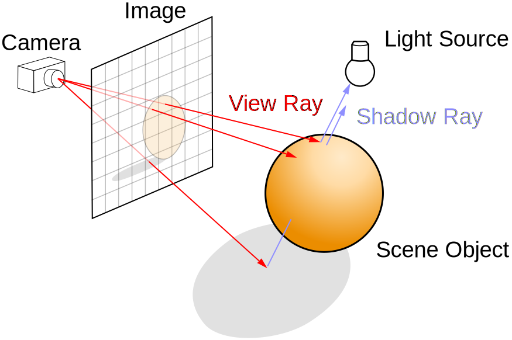
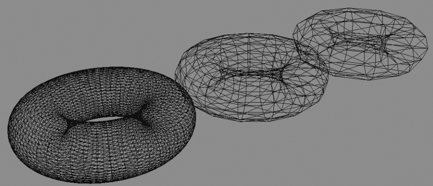
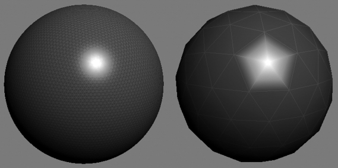
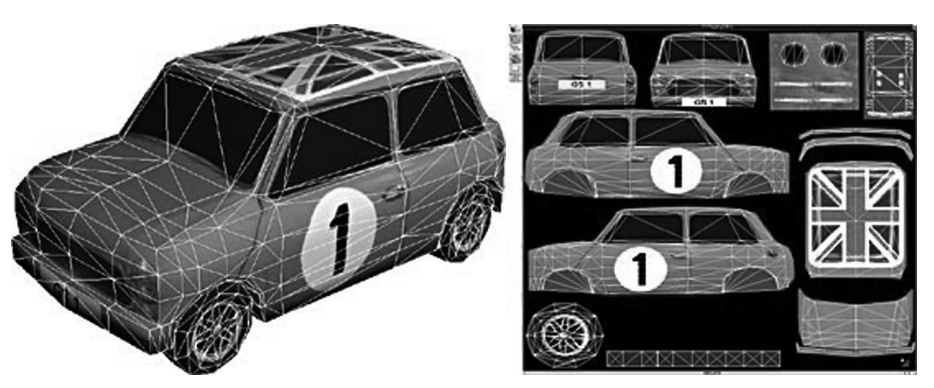
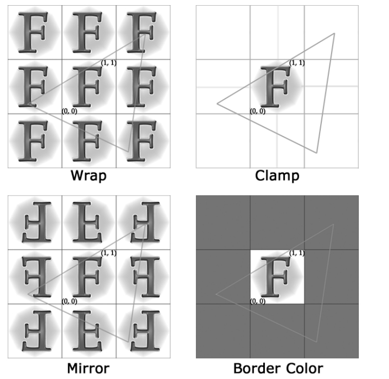
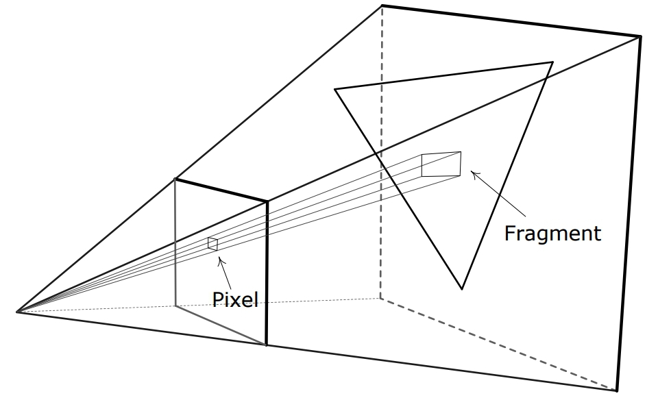
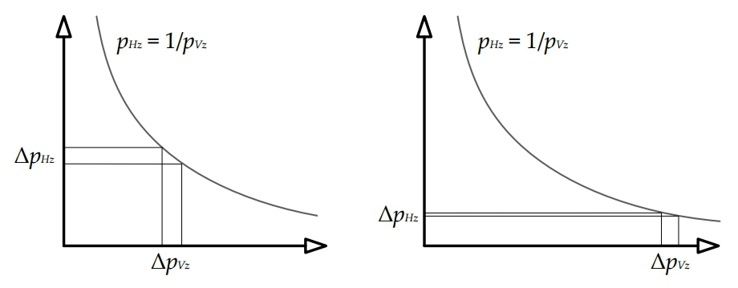

# Game Engine Architecture

## Rendering

---------------------
[nikoladimitroff.github.io/Game-Engine-Architecture](http://nikoladimitroff.github.io/Game-Engine-Architecture)

Nikola Dimitroff
<a href="mailto:nikola@dimitroff.bg"><i class="fa fa-envelope-o"></i></a>
<a href="https://github.com/nikoladimitroff"><i class="fa fa-github"></i></a>
<a href="https://dimitroff.bg"><i class="fa fa-rss"></i></a>

Dimitar Trendafilov
<a href="mailto:dimitar@coherent-labs.com"><i class="fa fa-envelope-o"></i></a>
<a href="https://github.com/dimitarcl"><i class="fa fa-github"></i></a>

--- NEXT SLIDE ---

# Sanity check

We are recording, aren't we?


--- NEXT SLIDE ---

## Review

What's the difference between these two lines?

```cpp
FModuleManager::UnloadModule(TEXT("Susi"));
FModuleManager::AbandonModule(TEXT("Susi"));
```

--- VERTICAL SLIDE ---

## Review

What do these things do `FMemory, FMalloc, FPlatformMemory`?

* <!-- .element class="fragment" data-fragment-index="0" --> `FMemory` is a high-level class for doing memory stuff
* <!-- .element class="fragment" data-fragment-index="0" --> `FMalloc` is an interface for UE4's multiple general-purpose allocators
* <!-- .element class="fragment" data-fragment-index="0" --> `FPlatformMemory` selects what should the global allocator be and has some memory stats

--- VERTICAL SLIDE ---

## Review

What's the final value of these config settings?

```
[/Script/Engine.PlayerInput]
Bindings=(Name="1",Command="EquipKnife")
.Bindings=(Name="1",Command="EquipSMG")
.Bindings=(Name="1",Command="EquipKnife")

[Internationalization]
+LocalizationPaths=../../../Engine/Content/Localization/Editor
+LocalizationPaths=../../../Engine/Content/Localization/EditorTutorials
+LocalizationPaths=../../../Engine/Content/Localization/Keywords
```

--- NEXT SLIDE ---

## Disclaimer

The following material should be covered by a complete course (at least one)
of its own.

--- NEXT SLIDE ---

## Rendering algorithms

How do you a draw 3D cats on a 2D screen?


--- VERTICAL SLIDE ---

## Ray tracing



--- VERTICAL SLIDE ---

Raytracing looks awesome! [Chaos Group](http://www.chaosgroup.com/en/2/index.html)
made a bussiness out of solving ray-tracing.

* [But it's reaaaaaaaaaaaly slow - 100+ rays for each pixel](http://www.longtail.com/the_long_tail/2006/12/pixar_quiz.html)
* So it mostly works on prerendered scenes (though it can be made to work for some cases)

Enter rasterization!

--- VERTICAL SLIDE ---

## Painter's algorithm


--- VERTICAL SLIDE ---

## Z-Buffer


--- VERTICAL SLIDE ---

## Scan-line


--- NEXT SLIDE ---

## Rendering a scene

* *virtual scene*
* *virtual camera*
* *light sources*
* *visual properties*

--- NEXT SLIDE ---


--- NEXT SLIDE ---

## Styles

* photorealistic
* cartoon
* charcoal sketch
* watercolor
* wool

--- NEXT SLIDE ---

## A scene

- set of objects
  - opaque
  - transparent
  - translucent


--- NEXT SLIDE ---

## Representations of objects

* equations
* NURBS
* subdivision
* triangle meshes

--- NEXT SLIDE ---

## Triangles

The triangle is the simplest type of polygon. Any fewer than three vertices,
and we wouldn’t have a surface at all.

- A triangle is always planar.
- Triangles remain triangles under most kinds of transformations, including
  affine transforms and perspective projections.
- Virtually all commercial graphics-acceleration hardware is designed around
  triangle rasterization.

--- NEXT SLIDE ---

## Tessellation

Triangulation

--- NEXT SLIDE ---



--- NEXT SLIDE ---

Constructing a triangle mesh

- Winding
- Triangle list
- indexed triangle list
- triangle strip
- triangle fan

--- NEXT SLIDE ---

Vertex cache optimization

--- NEXT SLIDE ---

- Model space
- World space and mesh instancing
  - buildings directly in world space (precision...)

--- NEXT SLIDE ---

## Surface properties

- diffuse color
- shininess / reflectivity
- roughness
- texture
- opacity
- refraction

--- NEXT SLIDE ---

## Vertex attributes

- position vector
- vertex normal
- vertex tangent
- diffuse color
- specular color
- texture coordinates
- skinning weights


--- NEXT SLIDE ---

## Attribute interpolation

--- NEXT SLIDE ---


--- NEXT SLIDE ---


--- NEXT SLIDE ---

Attribute interpolation is not enough




--- NEXT SLIDE ---

## Textures

- diffuse albedo
- texture coordinates
- texture addressing


--- NEXT SLIDE ---



--- NEXT SLIDE ---



--- NEXT SLIDE ---

- miplevel
- world-space texel density
- texture filtering
  - nearest neighbor
  - bilinear
  - trilinear
  - anisotropic


--- NEXT SLIDE ---

## Materials

--- NEXT SLIDE ---

## Lighting

- local and global illumination

--- NEXT SLIDE ---

- Phong Lighting model
- Blinn-Phong
- BRDF


--- NEXT SLIDE ---

- static lighting
- ambient lights
- directional lights
- point lights
- spot lights
- area lights
- emissive

--- VERTICAL SLIDE ---

* Gamma correction
* SRGB
* HDR

--- NEXT SLIDE ---

## Virtual Camera

- Frustrum

--- NEXT SLIDE ---


--- NEXT SLIDE ---

- Projections
  - Perspective projection

--- NEXT SLIDE ---


--- NEXT SLIDE ---

- Screen space
- Framebuffer

--- NEXT SLIDE ---

## Rasterization

--- NEXT SLIDE ---



--- NEXT SLIDE ---

Z-Buffer

--- NEXT SLIDE ---



--- NEXT SLIDE ---

W-Buffering

--- NEXT SLIDE ---

## Rendering Pipeline

--- NEXT SLIDE ---

- Tools stage (offline). Geometry and surface properties (materials) are de-
fined.
- Asset conditioning stage (offline). The geometry and material data are processed
by the asset conditioning pipeline (ACP) into an engine-ready
format.
- Application stage (CPU). Potentially visible mesh instances are identified
and submitted to the graphics hardware along with their materials for
rendering.
- Geometry processing stage (GPU). Vertices are transformed and lit and projected
into homogeneous clip space. Triangles are processed by the optional
geometry shader and then clipped to the frustum.
- Rasterization stage (GPU). Triangles are converted into fragments that are
shaded, passed through various tests (z-test, alpha test, stencil test, etc.)
and finally blended into the frame buffer.

--- NEXT SLIDE ---


--- NEXT SLIDE ---

## GPU pipeline

--- NEXT SLIDE ---


--- NEXT SLIDE ---

AA

--- NEXT SLIDE ---

Visibility detection

--- NEXT SLIDE ---

## Scene graphs

--- NEXT SLIDE ---


--- NEXT SLIDE ---

Deferred Rendering

--- NEXT SLIDE ---

Implementation details

- single-threaded
- multi-threaded
- task based

