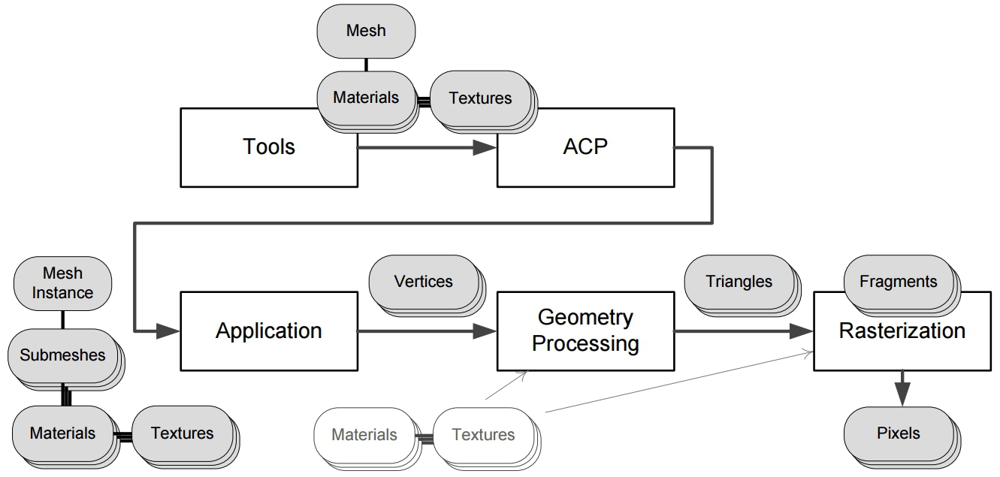

# Game Engine Architecture

## Rendering

---------------------
[nikoladimitroff.github.io/Game-Engine-Architecture](http://nikoladimitroff.github.io/Game-Engine-Architecture)

Nikola Dimitroff
<a href="mailto:nikola@dimitroff.bg"><i class="fa fa-envelope-o"></i></a>
<a href="https://github.com/nikoladimitroff"><i class="fa fa-github"></i></a>
<a href="https://dimitroff.bg"><i class="fa fa-rss"></i></a>

Alexander Angelov
<a href="mailto:aleksandar.angelovv@gmail.com"><i class="fa fa-envelope-o"></i></a>
<a href="https://github.com/Alekssasho"><i class="fa fa-github"></i></a>

Dimitar Trendafilov
<a href="mailto:dimitar@coherent-labs.com"><i class="fa fa-envelope-o"></i></a>
<a href="https://github.com/dimitarcl"><i class="fa fa-github"></i></a>

--- NEXT SLIDE ---

# Sanity check

We are recording, aren't we?


--- NEXT SLIDE ---

## Review

Why Ray tracing is not appropriate for real time rendering.

<!-- .element class="fragment" data-fragment-index="0" --> Really slow because of many rays needed for each pixel.

--- VERTICAL SLIDE ---

## Review

What is Global Lighting and how it is approximated in Phongs lighting model

* <!-- .element class="fragment" data-fragment-index="0" --> Indirect light in the scene
* <!-- .element class="fragment" data-fragment-index="0" --> Ambient coefficient which is added as constant

--- VERTICAL SLIDE ---

## Review

What is the difference between orthographics and perspective projection.

<!-- .element class="fragment" data-fragment-index="0" --> Orthographics preserve relative sizes and parallel lines

--- NEXT SLIDE ---

## Quick Recap

- Triangles
- Lighting
- Materials

--- NEXT SLIDE ---

## Rendering Pipeline

--- VERTICAL SLIDE ---

- Tools stage (offline). Geometry and surface properties (materials) are defined.
- Asset conditioning stage (offline). The geometry and material data are processed
by the asset conditioning pipeline (ACP) into an engine-ready
format.

--- VERTICAL SLIDE ---

- Application stage (CPU). Potentially visible mesh instances are identified
and submitted to the graphics hardware along with their materials for
rendering.
- Geometry processing stage (GPU). Vertices are transformed and lit and projected
into homogeneous clip space. Triangles are processed by the optional
geometry shader and then clipped to the frustum.
- Rasterization stage (GPU). Triangles are converted into fragments that are
shaded, passed through various tests (z-test, alpha test, stencil test, etc.)
and finally blended into the frame buffer.

--- VERTICAL SLIDE ---



--- NEXT SLIDE ---

## GPU Architecture


--- VERTICAL SLIDE ---

## throughput vs latency

--- NEXT SLIDE ---

## GPU pipeline

--- VERTICAL SLIDE ---


--- NEXT SLIDE ---

## DirectX11

--- VERTICAL SLIDE ---

### Initialization
- Device
- Device Context
- Swap Chain

--- VERTICAL SLIDE ---

- IASetInputLayout
- IASetVertexBuffers
- IASetIndexBuffer
- OMSetBlendState
- OMSetRenderTargets
- RSSetState

--- VERTICAL SLIDE ---

### Per shader

- [PS|VS|GS|HL|DL|CS] Prefix
- SetShader
- SetSamplers
- SetShaderResource
- SetConstantBuffers

--- VERTICAL SLIDE ---

### Resource Creation

- CreateTexture[1|2|3]D[Array]
- Shader Resource View
- Render Target View
- Depth Stencil View

- CreateBuffer

--- VERTICAL SLIDE ---

### Resource update

- UpdateSubresource
- Map/Unmap

--- VERTICAL SLIDE ---

### Draw

- Draw[Instanced][Indirect]
- DrawIndexed[Instanced][Indirect]

--- VERTICAL SLIDE ---

### Draw loop

```cpp
SortObjectsByShaderThenByMaterial();
SetState();
for(all shaders)
	SetShaders();
	for(all materials)
		SetMaterialProperties();
		for(all meshes)
			Draw();
```

--- VERTICAL SLIDE ---

### HLSL

```cpp
struct VertexShaderInput
{
  float4 Position : POSITION0;
  float3 Normal : NORMAL0;
  float2 TexCoords : TEXCOORD0;
};
```

--- VERTICAL SLIDE ---

```cpp
VertexShaderOutput VertexShaderFunction(VertexShaderInput input)
{
  VertexShaderOutput output;
  float4 posWorld = mul(input.Position, World);
  output.Position = mul(posWorld, ViewProjection);
  output.TexCoords = input.TexCoords;
  output.Normal = mul(input.Normal, (float3x3)World);
  output.WorldPos = posWorld;
  return output;
}
```

--- VERTICAL SLIDE ---

```cpp
float4 PixelShaderFunction(VertexShaderOutput input) : COLOR0
{
  // Get light direction for this fragment
  float3 lightDir = normalize(input.WorldPos - LightPosition);
  float diffuseLighting = saturate(dot(input.Normal, -lightDir));
  // Using Blinn half angle modification for perofrmance over correctness
  float3 h = normalize(normalize(CameraPos - input.WorldPos) - lightDir);
  float specLighting = pow(saturate(dot(h, input.Normal)), SpecularPower);

  return float4(
    AmbientLightColor +
    (DiffuseColor * LightDiffuseColor * diffuseLighting ) +
    (SpecularColor * LightSpecularColor * specLighting));
  }
```

--- NEXT SLIDE ---

Anti-Aliasing

--- VERTICAL SLIDE ---


--- VERTICAL SLIDE ---

- MSAA
- FXAA
- TXAA
- Others

--- VERTICAL SLIDE ---


--- NEXT SLIDE ---

## Forward Rendering and Deferred Rendering

--- VERTICAL SLIDE ---

Forward Rendering


--- VERTICAL SLIDE ---

Deffered Rendering


--- VERTICAL SLIDE ---

G-Buffer


--- NEXT SLIDE ---

Implementation details

- single-threaded
- multi-threaded
- task based

--- VERTICAL SLIDE ---

Async Compute

--- NEXT SLIDE ---

# Mobile GPU

--- VERTICAL SLIDE ---

Tiled deferred renderer

--- NEXT SLIDE ---

## Modern API

- Dx12
- Vulkan
- Metal

--- VERTICAL SLIDE ---

- Explicit Memory Allocation
- Explicit Resource Binding
- Explicit Synchronizations

--- VERTICAL SLIDE ---


--- NEXT SLIDE ---

## GPU Debugging

--- VERTICAL SLIDE ---

Every vendor has custom tools

- NVidia NSight
- AMD Perf Studio
- PIX
- Renderdoc

--- VERTICAL SLIDE ---


