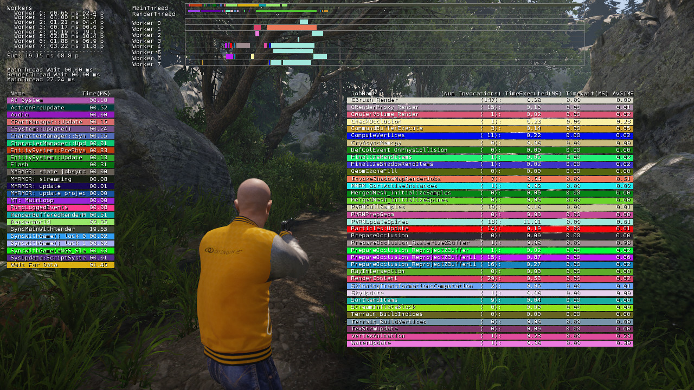

# Game Engine Architecture

## Tools

---------------------
[nikoladimitroff.github.io/Game-Engine-Architecture](http://nikoladimitroff.github.io/Game-Engine-Architecture)

Nikola Dimitroff
<a href="mailto:nikola@dimitroff.bg"><i class="fa fa-envelope-o"></i></a>
<a href="https://github.com/nikoladimitroff"><i class="fa fa-github"></i></a>
<a href="https://dimitroff.bg"><i class="fa fa-rss"></i></a>

Alexander Angelov
<a href="mailto:aleksandar.angelovv@gmail.com"><i class="fa fa-envelope-o"></i></a>
<a href="https://github.com/Alekssasho"><i class="fa fa-github"></i></a>

Dimitar Trendafilov
<a href="mailto:dimitar@coherent-labs.com"><i class="fa fa-envelope-o"></i></a>
<a href="https://github.com/dimitarcl"><i class="fa fa-github"></i></a>

--- NEXT SLIDE ---

# Sanity check

We are recording, aren't we?


--- NEXT SLIDE ---

## Review

Compare the RHI thread and the Renderer thread.

--- VERTICAL SLIDE ---

## Review

How do you run code on the renderer thread from the game thread?

<!-- .element class="fragment" data-fragment-index="0" --> `ENQUEUE_UNIQUE_RENDER_COMMAND_XXX`

--- VERTICAL SLIDE ---

## Review

What's a fence (in the context of command queues, not exterior design)?

<!-- .element class="fragment" data-fragment-index="0" --> A command created for tracking the status of other commands.

--- NEXT SLIDE ---

Tools are usually developed by a separate team and
can provide assistance for all kinds of stuff.

We'll focus on programming helpers.

--- NEXT SLIDE ---

## Automation

Game development is software engineering after all

* Automatic build systems
* Continious integration
* Testing suites - for both QA and performance

--- NEXT SLIDE ---

--- VERTICAL SLIDE ---

## Memory profiling

* Just as important
* Not as easy
    - Sucky third-party libraries lack allocator hooks
    - VRAM has nothing to do main RAM

--- VERTICAL SLIDE ---

## Memory leaks and corruption

--- VERTICAL SLIDE ---

### Leaks

Use a custom allocator for everything and dump leaks on exit.

```
#define MYNEW(System) new (System, __FILE__, __LINE__)

void* operator new(size_t size, Subsystem s, const char* file, int line) {
    return m_Allocs[s].Allocate(size, file, line);
}
```

#### Allocators

- tcmalloc
  - can create a detailed report of how much memory each function has allocated
- jemalloc
- heaplayers

--- VERTICAL SLIDE ---

#### Tools

- Visual Studio
  - snapshot and snapshot comparison
- Valgrind
- Dr. Memory
- Heap Profiler

--- VERTICAL SLIDE ---

### Heap corruption

- reading un-initialized data
- reading or writing not-allocated memory

--- VERTICAL SLIDE ---

- Visual Studio in debug mode has checks for corruption
- Static analyzers can catch some of the errors
- Address Sanitizer
  - small performance impact
  - catches uninitialized read, use-after-free, out-of-bounds access, etc
- Valgrind - memcheck

--- NEXT SLIDE ---

## Logging and tracing

--- NEXT SLIDE ---

### Logging

- log functional aspects of the program
  - "Player John Doe has logged with avatar Johny"
- log to a console and to a file

--- NEXT SLIDE ---

### Tracing

- similar to logging
- shows what functions/code has been executed
  - "PlayerLogin()"

--- NEXT SLIDE ---

### Event tracing

Shows events in the program:

- allocations
- locks
- exceptions
- custom

--- NEXT SLIDE ---

- Event Tracing for Windows (ETW)
  - xperf
  - all the above combined with events from Windows
    - CPU usage
    - disk stall
    - ...
  - can be used for CPU, GPU and heap profiling

https://randomascii.wordpress.com/2015/09/24/etw-central/

--- NEXT SLIDE ---

chrome://tracing

- https://github.com/catapult-project/catapult
- https://github.com/hrydgard/minitrace
- https://github.com/01org/IntelSEAPI

--- NEXT SLIDE ---

- systrace - Android
- strace - system calls on POSIX
- dtrace - Sun, Solaris, SystemTap for Linux

--- NEXT SLIDE ---

## Crash reporting

- collect everything possible and send it home
- google breakpad
- Mozilla's Socorro - https://github.com/mozilla/socorro
- Windows error reporting

https://crash-stats.mozilla.com/home/product/Firefox

--- VERTICAL SLIDE ---

- OS has a callback that is called when the process is about to crash
  - collect data and save minidump
  - start another process to upload the data and the dump

--- VERTICAL SLIDE ---

### Minidump debugging

- Snapshot of the program state the moment it has crashed
  - Might be with heap, might be without heap

--- VERTICAL SLIDE ---

- Symbols - *pdb* files, *dsym*
  - minidumps are almost *useless* without symbols
- Source servers - automatically retrieve the version of the file that matches
  the one in the crashed game

--- NEXT SLIDE ---

## Telemetry

Send data and stats home while the game is running

- FPS
- Memory usage
- CPU utilization
- (Gameplay events)

--- VERTICAL SLIDE ---

## Heatmap everything

- find places with too many or too heavy objects
- (find places where the game is too hard)

--- NEXT SLIDE ---

## CPU Debugging

Learn your favourite debugger + one more


--- VERTICAL SLIDE ---

* Conditional & data-breakpoints
* Tracepoints
* Watches
* Memory & register contents
* Tasks & threads
* Disassembly

* Instruction pointer modifications
* Immediate window

--- VERTICAL SLIDE ---

```cpp
while (!::IsDebuggerPresent())
{
    Sleep(1000);
}
```

--- NEXT SLIDE ---

## GPU Debugging


--- VERTICAL SLIDE ---

* Drawing red pixels
* Alt + F
* Disable passes
* Render auxillary textures (shadow maps, depth maps)

--- NEXT SLIDE ---

## Debug drawing

When numbers don't cut it


--- VERTICAL SLIDE ---

* Characters going through trees? Draw collision primitives.
* Stormtroopers missing the enemy? Draw projectile trajectories...oh, wait
* AI circling like idiots? Draw path-finding results.

--- VERTICAL SLIDE ---

It doesn't stop there!

* Print text in 2D / 3D (Stats, reminders)
* Customization
    - Color management
    - Lifetime management

--- VERTICAL SLIDE ---

Making errors clear


--- VERTICAL SLIDE ---

## Screen capture

* `CopyGPUMemoryInCPU(void* dst, const void* src);`
* Do we capture HUD? Debug drawings?
* Capture frames in quick succession? Capture a movie?

--- NEXT SLIDE ---

## Debug cameras

Detaching from the player controller

--- NEXT SLIDE ---

## Time control

* Pausing and playing on demand

```cpp
auto delta = Now() - lastFrame;
delta *= timeScale;
Update(delta);
```

--- VERTICAL SLIDE ---

## Replay

* Record commands & dump to disk
* Load and replay
* Easy to do with the command pattern

--- NEXT SLIDE ---

## In-game dev menus


--- VERTICAL SLIDE ---

## In-game consoles

Like the in-game dev menu...but better

* Extensible commands
* Code completion
* REPL

--- VERTICAL SLIDE ---

## Cheats

There's a reason why iseedeadpeople and panzer exist

--- NEXT SLIDE ---

## Optimizations

--- VERTICAL SLIDE ---

- do not optimize prematurely
- do not pessimize on purpose

--- VERTICAL SLIDE ---

### How to optimize a game

- The hollistic approach

--- VERTICAL SLIDE ---

- Benchmark
- Detection *
- Solution *
- Measure *
- Repeat

--- VERTICAL SLIDE ---

Levels

- System - CPU, GPU bound
- Algorithmic - too many matrices interacting with too many vertices
- Micro - too many additions, multiplications and memory fetches

--- NEXT SLIDE ---

### Profiling

The process of inspecting a program's runtime performance

--- VERTICAL SLIDE ---

## Sampling (statistical) profilers

* Dо not require program modifications
* Stop the program (thread) at fixed intervals and record the callstack
* Due to the [Law of Large numbers](https://en.wikipedia.org/wiki/Law_of_large_numbers),
the sample must be close to the actual data

--- VERTICAL SLIDE ---

## Instrumentation profilers

* Can be implemented at multiple levels
    - Manual - the programmer annotates parts of the code
    - Automatic - the compiler inserts special tracing instructions (`gcc -pg`)
* More precise records
* Less-reliable as it significantly changes performance
(e.g. the profiling code can trash the cache)

--- VERTICAL SLIDE ---

```cpp
int main()
{
    while (true)
    {
        {
            PROFILE_SCOPE("Update");
            Update();
        }
        Render();
    }
};
```

--- VERTICAL SLIDE ---

```cpp
class ProfilerScope
{
    ProfilerScope(const char* name) :
        m_Name(name),
        m_Start(GetHighResolutionTime())
    {}
    ~ProfilerScope()
    { g_Profiler->Record(name, GetHighResolutionTime() - m_Start); }
};

#define PROFILE_SCOPE(name) \
ProfilerScope _scoped(name);
```

--- VERTICAL SLIDE ---

The function name alone is not enough - we need the call graph.

* Inclusive time - the time spend in the function itself and its callees
* Exclusive time - the time spend in the function itself
* Time per call vs number of calls


--- VERTICAL SLIDE ---

#### Profilers

- Visual Studio
- Valgrind - callgrind
- VerySleepy
- VTune
- gperf
- Remotery - https://github.com/Celtoys/Remotery

--- NEXT SLIDE ---

## In-game profiling



--- VERTICAL SLIDE ---

* Overbudgeting
* Dumping data
    - Excel is your friend
    - [History is an even better friend](http://coherent-labs.com/blog/how-do-we-test-performance-in-coherent-labs/)

--- NEXT SLIDE ---

Questions?

