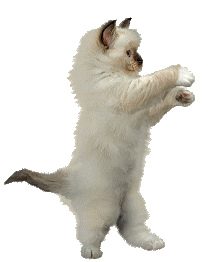
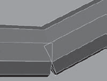
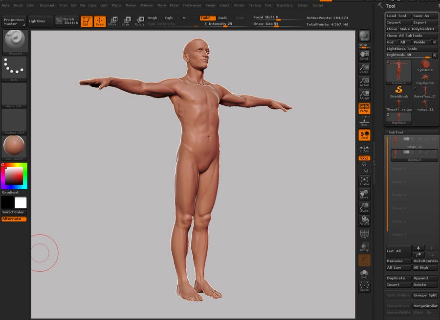
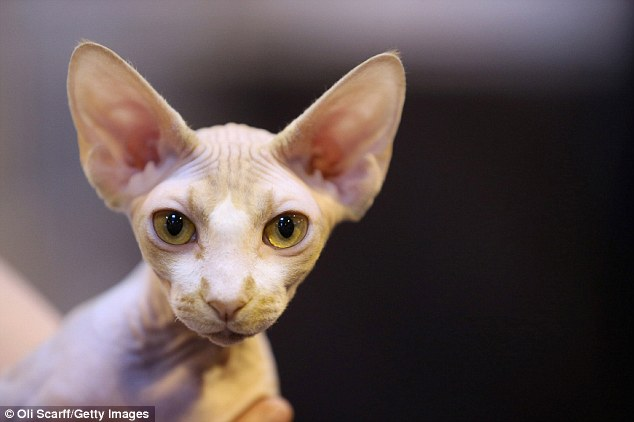
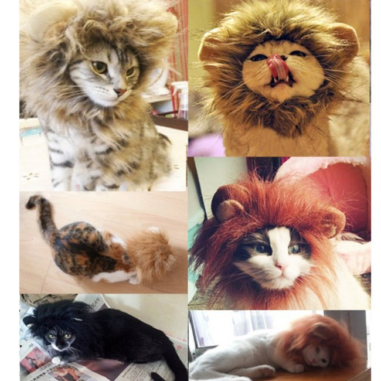
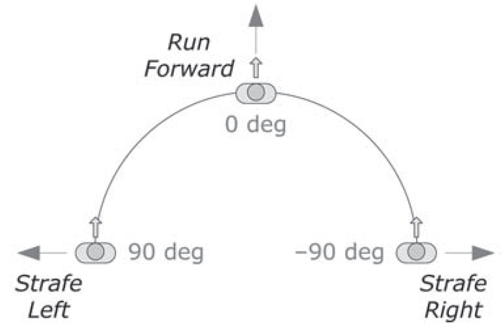

# Game Engine Architecture

## Animations

---------------------
[Course Index](http://nikoladimitroff.github.io/Game-Engine-Architecture)

<div class="authors-section">
<table>
<tbody>
    <tr>
        <td>
            Nikola Dimitroff
        </td>
        <td>
            <a target="_blank" href="https://dimitroff.bg"><i class="fa fa-rss"></i></a>
            <a target="_blank" href="mailto:nikola@dimitroff.bg"><i class="fa fa-envelope-o"></i></a>
            <a target="_blank" href="https://github.com/nikoladimitroff"><i class="fa fa-github"></i></a>
            <a target="_blank" href="https://twitter.com/nikoladimitroff"><i class="fa fa-twitter"></i></a>
        </td>
    </tr>
    <tr>
        <td>
            Alexander Angelov
        </td>
        <td>
            <a target="_blank" href="mailto:aleksandar.angelovv@gmail.com"><i class="fa fa-envelope-o"></i></a>
            <a target="_blank" href="https://github.com/Alekssasho"><i class="fa fa-github"></i></a>
            <a target="_blank" href="https://twitter.com/Alekssasho"><i class="fa fa-twitter"></i></a>
        </td>
    </tr>
    <tr>
        <td>
            Viktor Ketipov
        </td>
        <td>
            <a target="_blank" href="mailto:viktor@kipiinteractive.com"><i class="fa fa-envelope-o"></i></a>
            <a target="_blank" href="https://github.com/k1p1"><i class="fa fa-github"></i></a>
            <a target="_blank" href="https://twitter.com/xk1p1x"><i class="fa fa-twitter"></i></a></p>
        </td>
    </tr>
</tbody>
</table>
</div>

<div class="companies-section">
<a class="ubisoft-logo" href="https://ubisoft.com" target="_blank"></a>
<br>
<a class="kipi-logo" href="http://kipiinteractive.com" target="_blank"></a>
</div>

--- NEXT SLIDE ---

# Sanity check

We are recording, aren't we?


--- NEXT SLIDE ---

## Review

What's the rendering pipeline? What are the vertex and pixel (fragment) shaders?

<!-- .element class="fragment" data-fragment-index="0" --> * A model describing the steps needed to render a scene.
Some steps are programmable (shaders), some steps are configurable (GPU state), others are fixed.
<!-- .element class="fragment" data-fragment-index="1" --> * The vertex shader is a GPU program that takes vertex
data as input and transforms it in someway. Usually converts the coordinates from model space to screen space.
<!-- .element class="fragment" data-fragment-index="2" --> * The pixel shader is a GPU program that takes pixel
data (the result of rasterizing the triangles in the scene) as input and outputs the final color for that pixel.
This is where lightning happens usually.

--- VERTICAL SLIDE ---

## Review

What are RGB and HSL?

<!-- .element class="fragment" data-fragment-index="0" --> Both are color spaces. RGB defines a cube whose dimensions
represent the values of the red, green and blue channels. HSL defines a double cone whose dimensions represent the
hue, saturation and lightning values.

--- VERTICAL SLIDE ---

## Review

What's a material?

<!-- .element class="fragment" data-fragment-index="0" --> An object that sets all possible rendering properties.
Rendering properties include constants (e.g. diffuse color), textures (e.g. normal map) and shaders (e.g. lightning model).

--- NEXT SLIDE ---

## Animation algorithms



--- VERTICAL SLIDE ---

### Cel and sprite animations

--- VERTICAL SLIDE ---

The oldest form of animation - draw the different frames and show them fast
enough, so that it appears smooth.

- *cel* is a transparent sheet on which images can be drawn
- different *cels* are applied over the static background to achieve the
  animated effect, without drawing everything from scratch

--- VERTICAL SLIDE ---


--- VERTICAL SLIDE ---

<iframe src="http://examples.phaser.io/embed.php?f=animation/sprite+sheet.js">
</iframe>

--- VERTICAL SLIDE ---

* Spritesheets are used for effects in UI
* Spritesheets can use huge amount of video memory, but they can be
[compressed](https://github.com/mainroach/crabby)


--- VERTICAL SLIDE ---

Sprite animation in 3D

* Causa perduta

--- VERTICAL SLIDE ---

## Rigid body hierarchy

- model the character as a collection of rigid bodies

--- VERTICAL SLIDE ---

- pelvis
  - torso
    - upper right arm
      - lower right arm
        - right arm
    - upper left arm
      - lower left arm
        - left arm
  - upper right leg
    - lower right leg
      - right foot
  - upper left leg
    - lower left leg
      - left foot

--- VERTICAL SLIDE ---



--- VERTICAL SLIDE ---

- Cracking at the joints
  - looks ugly
  - makes for unrealistic movements

--- VERTICAL SLIDE ---

## Morph targets

- Rigid body does not work well enough
- Animate each vertex instead
  - will create huge amounts of data

--- VERTICAL SLIDE ---

- The artist creates the extreme positions of the vertices
- The extreme positions will be a smaller set
- The rest of the positions are computed as linear interpolation between two or
  more extemes

--- VERTICAL SLIDE ---

- Used primarly for facial animations
  - human face has 50 muscles
  - we are quite sensitive to facial expressions

--- NEXT SLIDE ---

## Skinned animations

- allows the triangles of the character to deform
- has the performance and memory requirements of the rigid body animation
- it is the most widely used today
- it's so good people [brought it to 2D](http://esotericsoftware.com/)

--- VERTICAL SLIDE ---

- The character has a skeleton of rigid bones connected with joints
- the skeleton is hidden behind the skin - a smooth and continous triangle mesh
  - (this avoids the joint cracking)
- AKA skeleton animation


--- VERTICAL SLIDE ---

### Bones

The term *bones* and *joints* are used interchangeably in literature

- There are no bones actually in the skeleton
    - To be anatomically correct, the bones would be the edges
    between joints but no one calls them that
- All that matters is the positions of the joints

--- VERTICAL SLIDE ---


--- VERTICAL SLIDE ---

- pelvis
  - torso
    - upper right arm
      - lower right arm
        - right arm
    - upper left arm
      - lower left arm
        - left arm
  - upper right leg
    - lower right leg
      - right foot
  - upper left leg
    - lower left leg
      - left foot

*<Insert more joints for extra details>*

--- VERTICAL SLIDE ---

```cpp
struct Joint
{
    Matrix4x3 InverseBindPose;
    const char* Name;
    unsigned char ParentIndex;
};
struct Skeleton
{
    unsigned char JointCount;
    Joint* Joints;
};
```

--- NEXT SLIDE ---

## Poses

* The way a skeleton looks at a given time
* The pose of a joint is simply its current transformation
* The pose of a skeleton is a list of joint poses

--- VERTICAL SLIDE ---

#### Bind pose (T-pose)

* The default pose of the mesh, used for binding the skeleton



--- VERTICAL SLIDE ---

* Poses are either local or global
    - local express the transformation in joint-space
    - global poses express the transformation in model-space

--- VERTICAL SLIDE ---

#### Local poses

```cpp
struct JointPose
{
    float Quaternion[4];
    float Translation[3];
    float Scale; // or float Scale[3] but that's usually not needed
};
struct SkeletonPose
{
    Skeleton* SkeletonPtr;
    JointPose* Pose;
};
```
$$
P^{skeleton} = \{ P\_j \}, 0 < j < n
$$

--- VERTICAL SLIDE ---

#### Global poses

The matrix of each joint's pose represents a coordinate
system change from the joint to its parent. Thus, the
transform from joint to model space is:

$$
P\_{j \to M} = \prod\_{i=j}^{0} P_{j \to p(j)} \\\\
assuming i = p(i)
$$


--- NEXT SLIDE ---

## (Animation) Clips

* Often called simply *animations*
* A list of poses that represent the character
at each keyframe.

--- VERTICAL SLIDE ---

### Clip timelines

* Local - starts at $t = 0$, ends at $t = Clip_{Duration}$
* Normalized - starts at $t = 0$, ends at $t = 1$
* Global - starts at $t = CurrentTime()$, ends at $t = t\_{start} + Clip_{Duration}$

--- VERTICAL SLIDE ---

* Playing a clip is the same as adding its local timeline
to the global one.
* The local timeline can be scaled (including reversed)
* Given:
    - the global start time $\tau_{start}$
    - the playback rate $R$
    - the duration $T$

Then mapping local time ($t$) to global time ($\tau$) is done as follows:

$$
t = R(\tau - \tau\_{start}) \\\\
\tau = \tau_{start} + { t \over R }
$$

--- VERTICAL SLIDE ---

#### Timeline advantages

* Local - straightforward
* Global - allows for easy synchronization
* Normalized - allows for synchronization between two clips
of different length

--- VERTICAL SLIDE ---

```cpp
struct AnimationClip
{
    float AnimationDuration;
    float CurrentTime; // Could be local, global or normalized
    float PlaybackRate;

    Skeleton* SkeletonPtr;

    typedef JointPose* SkeletonPose; // aka SkeletonSample
    SkeletonPose* Poses;
};
```

--- NEXT SLIDE ---

## Skinned mathematics

...I couldn't not put a *skinny* cat for obvious reasons



--- VERTICAL SLIDE ---

* Each vertex is bound to one or few joints
* Multiple joints require *weights*

```cpp
struct SkinnedVertex
{
    float Position[3];
    // Insert other relevant data - texture coordinates, normal, tangent

    // 4 is plenty of joints
    unsigned char JointIndices[4];
    // We only need 3 joints - weights are normalized
    float JointWeights[3];
};
```

--- VERTICAL SLIDE ---

* Denote the bind pose with $B$ and the current pose with $C$
* Denote $v_M^B$ the position of vertex $v$ in model space in pose $B$
* We thus have to find the matrix transforming from $B$ to $C$.
Call it a *skinning matrix*.

--- VERTICAL SLIDE ---

* Realization: the vertex coordinates are constant in joint space
* Idea: go to joint space and apply the current pose's transformation!

$$
v\_j = B\_{M \to j} v\_M^B = B\_{j \to M}^{-1} v\_M^B \\\\
v\_M^C = C\_{j \to M} v\_j
$$

The skinning matrix is $S\_j = C\_{j \to M} B\_{j \to M}^{-1}$

--- VERTICAL SLIDE ---

The set of skinning matrices for each joint is known as *matrix palette*.

All we now need is to send the matrix palette to the renderer.

```hlsl
float4 VertexShaderMain(VSInput input) : SV_POSITION
{
    // VERY IMPORTANT NOTE
    // WeightedAverage on matrices is tricky. See next section
    float4 skinnedPosition;
    for (int i = 0; i < 4; ++i)
    {
        skinnedPosition += input.JointWeights[i] *
                           input.Joint[i] *
                           input.Position;
    }
    float4 position = ViewProjectionMatrix *
                      WorldMatrix *
                      skinnedPosition;
    return position;
}
```

--- VERTICAL SLIDE ---

Add the model-to-world / model-to-screen transform?

$$
(S\_j)\_w = M\_{M \to W} C\_{j \to M} B\_{j \to M}^{-1}
$$

* Saves an extra multiplication
* Messes up animation instancing

--- NEXT SLIDE ---

## Blending

The process of mixing multiple ~~cats~~ clips (poses) to make more



--- VERTICAL SLIDE ---

### Example usages

* Interpolation between 2 keyframes
* Transitition between animations
* Combining multiple animations to get a new one
    - Walking + Shooting = Rambo

--- VERTICAL SLIDE ---

* Blending is simply interpolation!
* Linear / spherical interpolation does wonders 99% of the time

$$
(P\_{result})\_j = lerp((P\_A)\_j, (P\_B)\_j, t)
$$

--- VERTICAL SLIDE ---

Blending poses requires matrix interpolation.

```
Matrix4x4 InterpolateMatrices(float alpha,
    const Matrix4x4& first, const Matrix4x4& second)
{
    return alpha * first + (1 - alpha) * second;
}
```

--- VERTICAL SLIDE ---

Easy, right?

<iframe width="560" height="315" src="https://www.youtube.com/embed/tLlsb5H9uuA" frameborder="0" allowfullscreen></iframe>

--- VERTICAL SLIDE ---

* Matrix interpolation cannot be done efficiently (must be decomposed)
    - See Graphics Gems 2, the 'unmatrix' method
* ...which is why we use SQT, not matrices!

--- VERTICAL SLIDE ---

### Examples revisited: blend between keyframes

Even if you have 60 frames per seconds of animation data,
you will still need to sample at frame 4.2

$$
\beta = { {t - t\_1 } \over { t\_2 - t\_1 } } \\\\
P\_{result} = lerp(P\_A, P\_B, \beta)
$$

--- VERTICAL SLIDE ---

### Examples revisited: crossfading between animations

Fade from $A$ to $B$ by gradually increasing $\beta$

$$
\beta = \beta + \Delta \beta \\\\
P_{result} = lerp(P_A, P_B, \beta)
$$

--- VERTICAL SLIDE ---

### Examples revisited: implementing strafing



http://threejs.org/examples/webgl_animation_skinning_blending.html

--- NEXT SLIDE ---

Say you want to reuse the waving animation and the running animation
to achieve run-and-wave

##### Idea 1

* Disable the right-hand joints for the running animation
* Enable the right-hand joints for the waving animation
* This is *partial blending* and more often fails than works

--- VERTICAL SLIDE ---

## Enter additive blending

Step 1: Compute the difference $D$ between two poses $S$ (source) and $R$ (reference)

$$
D\_j = S\_j R\_j^{-1}
$$

Step 2: Add the difference to a target pose $T$ to get the final pose $F$

$$
F\_j = D\_j T\_j
$$

--- VERTICAL SLIDE ---

* Additive blending beats partial blending by not having
abrupt discontinuities
    - Unless you happen have too much rotation

--- NEXT SLIDE ---

## Post-processing

* Procedurally-generated animations to add noise
    - Rag dolls
    - Inverse kinematics

--- NEXT SLIDE ---

## Compression

* A *channel* is the list of all values with the same semantic -
all *x* components of the translation per joint


* 10 channels per joint (3 for translation, 4 for rotation, 3 for scaling)
* 4 bytes per channel
* 100 joints per skeleton
* 30 samples / second per clip

$$
4 \* 10 \* 100 \* 30 = 117 KB/s
$$

--- VERTICAL SLIDE ---

### Compression techniques

* Channel ommission
    - Do you need all 4 elements of the quaternion?
    - Do you need scaling & translation?
* Quantization
    - Do you need 7 digits of precision?
* Reduce content size
    - Do you need 30 frames / second?
* Converting channels to continious functions
    - Can you fit a curve in the channel?
* Loading
    - Can you like, not use this animation?

--- NEXT SLIDE ---

## Implementation details

### Metachannels

SQT data is not the only thing you need in a clip

* Texture coordinates
* Event triggers

--- VERTICAL SLIDE ---

### Architecture

Split the animation system

* Animation pipeline
    - load
    - blend
    - to global
    - IK
    - to global
    - prepare to render
* Blend trees & Action-state machines
* Animation controllers

--- VERTICAL SLIDE ---

Optimize sharing data

* Reuse the skeleton
* Reuse clips

--- VERTICAL SLIDE ---

#### Blend trees

Provide artist-friendly approach to combining animations

#### Action-state machines

Provide artist-friendly approach to managing animations

#### Animation controllers

Provide programmer-friendly approach to triggering animations

--- NEXT SLIDE ---

~~Question~~ Awkard silence time
