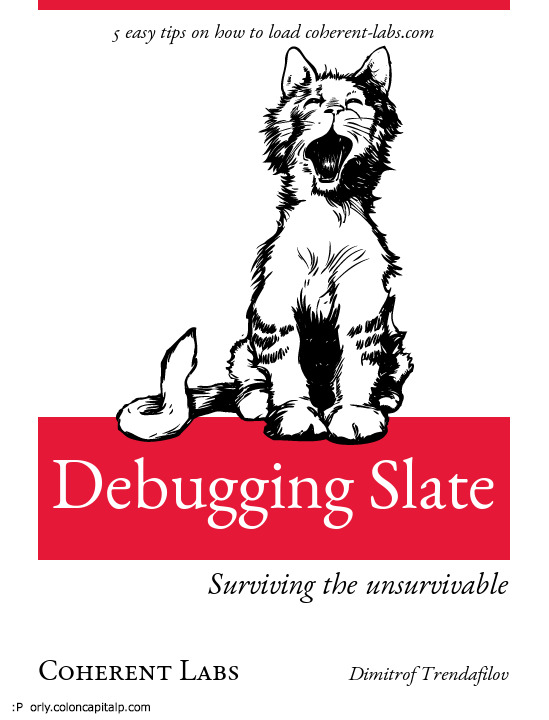

# Game Engine Architecture

## User interface in UE4

---------------------
[nikoladimitroff.github.io/Game-Engine-Architecture](http://nikoladimitroff.github.io/Game-Engine-Architecture)

Nikola Dimitroff
<a href="mailto:nikola@dimitroff.bg"><i class="fa fa-envelope-o"></i></a>
<a href="https://github.com/nikoladimitroff"><i class="fa fa-github"></i></a>
<a href="https://dimitroff.bg"><i class="fa fa-rss"></i></a>

Dimitar Trendafilov
<a href="mailto:dimitar@coherent-labs.com"><i class="fa fa-envelope-o"></i></a>
<a href="https://github.com/dimitarcl"><i class="fa fa-github"></i></a>

--- NEXT SLIDE ---

# Sanity check

We are recording, aren't we?


--- NEXT SLIDE ---

Remember, remember,

the ~~5th~~ 26th of ~~November~~ May

[Also the 17th of May](https://www.facebook.com/events/585418558291881/)
<-- EXCLUSIVE!!!! UNBELIAVABLE! CLICK HERE FOR FREE BEER


--- NEXT SLIDE ---

## Review

You start working on a new game. Your engine either lacks an UI
system or its UI system is crappy. Do you...

1. Fix it
2. Start all over
3. Replace it with something new
4. <!-- .element class="fragment" data-fragment-index="0" --> **You go to http://coherent-labs.com**

--- VERTICAL SLIDE ---

## Review

How does one draw text?

* <!-- .element class="fragment" data-fragment-index="0" --> Rasterization
* <!-- .element class="fragment" data-fragment-index="0" --> SDF

--- NEXT SLIDE ---

Contents

- Slate
- UMG
- BLUI
- Coherent GT

--- NEXT SLIDE ---

UE4 currently has two UI systems

- Slate - low-level, C++ driven
- UMG - high-level, WYSIWYG, uses Slate under the hood, came in 4.6

--- NEXT SLIDE ---

## Slate

* Custom, platform-agnostic
* Used throughout the entire engine
* Declarative syntax (albeit C++)

--- VERTICAL SLIDE ---

> with the ability to easily design, layout, and style
> components that allows for easily creating and iterating on UIs.

<!-- .element class="fragment" data-fragment-index="0" --> 

--- VERTICAL SLIDE ---

#### ./hatermode --on Slate

* Slate is a one big exception
* Full of macro-magic
* Things don't work as you expect them to more often than not.
    - Like the HTML5 standard but 100 times worse.
* Animations are super easy - just some C++! Super-artisty!

--- VERTICAL SLIDE ---

#### It's declarative!

`SSusiLoginScreep::ConstructInitialLoginScreen`

Vs.

```
<style>
    form {
        background-color: gray;
        border: 1px solid gray;
    }
    * {
        color: red;
        font: 20px Verdana;
    }
</style>
<form>
    <label>Enter your credentials</label>
    </br>
    <label>Username: <input id="username"/></label>
    </br>
    <label>Password: <input id="password" type="password"/></label>
    </br>
    <button id="login">Login</button>
</form>
<script>
    document.getElementById("login")
    .addEventListener("click", onLoginButtonClicked);
</script>
```

--- NEXT SLIDE ---

#### ./hatermode --off Slate

Then again Slate is:

* Easy to extend
* Data-driven
* People can get used to it

--- NEXT SLIDE ---

## Slate Architecture

* Implemented in two modules
    - *SlateCore* - implements the framework
    - *Slate* - implements concrete components
* Slate UI is broken down to components, each called a *widget*
* It all starts at `SWidget`
    - The base class for everything Slate-related
    - ** STOP. DO NOT INHERIT DIRECTLY FROM WIDGET! **
    - Implements a great deal of things

--- VERTICAL SLIDE ---

## Slate basics

* Requires 3 passes
* Bottom-up traversal: compute widget size
* Top-down traversal: layout children

```
    |<-----------22---------->|
    +-------------------------+
    |     SHorizontalBox      |
    +-------------------------+
      +----=----+ +----=----+
      |    ?    | |    ?    |
      +----+----+ +----+----+
           ^           ^
           |           |
        +--+           +--+
        |                 |
   +----+---------+  +----+--+
   |STextBlock    |  |SImage |
   +---------+----+  +-------+
   |<---- 14----->|  |<--8-->|
```

--- VERTICAL SLIDE ---

* Top-down traversal: paint

```cpp
OutputElements OnPaint( AllottedGeometry )
{
    // Arrange all the children given our allotted geometry
    Array<ArrangedChild> ArrangedChildren = ArrangeChildrenGiven( AllottedGeometry );

    // Paint the children
    for each ( Child in ArrangedChildren )
    {
        OutputElements.Append( Child.Widget.OnPaint( Child.Geometry ) );
    }

    // Paint a border
    OutputElements.Append( DrawBorder() );
}
```

--- VERTICAL SLIDE ---

## Slate tenets

* Use polling instead of events when possible
* Limit cache usage
* Layout and draw everyting each frame
* It's ok to recreate the **ENTIRE** UI
    - The blueprint editor
* Use `TAttribute` <-- MUCH USEFUL, VERY GOING-TO-BE-ON-THE-TEST
* Use events everywhere

--- VERTICAL SLIDE ---

### Data-driveness

```
+-----------------+                         +--------------+
| SEditableText   |                         |           {s}|
+-----------------+                         | Model Data   |
|                 |      /----------\       +--------------+
|         o Text  +<--=--+ ReadData +---=---+              |
|                 |      \----------/       |  item name   |
|                 |      /-----------\      |              |
| o OnTextChanged +---=--+ WriteData +--=-->+              |
|                 |      \-----------/      +--------------+
+-----------------+
```

--- VERTICAL SLIDE ---

### Slate basics

Three important methods:

* `ComputeDesiredSize()` - responsible for desired size.
* `ArrangeChildren()` - responsible for arrangement of children within
the parent's allotted area.
* `OnPaint()` - responsible for appearance. Versatile - can even use materials
to draw!

You also have access `Tick(float)`

--- NEXT SLIDE ---

## `SWidget` branches

* `SLeafWidget` - a *final* widget, does one thing and does it good (`STextBlock`, `SImage`)
* `SComponentWidget` - a *composition* of widgets (`SSusiLoginScreen`)
* `SPanel` - a *list* of widgets (`SHorizontalBox`)

All widgets should inherit one of the above!

--- NEXT SLIDE ---

## Child slots

Slots are at the heart of Slate's composition mechanism

* Slots are objects that allow widgets to be contained
inside other widgets
* `SCompoundWidget` has exactly one slot that's never null (`SNullWidget`)
* `SBoxPanel` has multiple slots

--- NEXT SLIDE ---

## Creating Slate widgets - Slate++

```cpp
SNew(SHorizontalBox)
    +SHorizontalBox::Slot()
    .HAlign(HAlign_Left)
    .AutoWidth()
    .Padding(10)
    [
        SNew(SBorder)
        .BorderBackgroundColor(ScreenStyle.BackgroundColor)
        .VAlign(VAlign_Fill)
        .HAlign(HAlign_Fill)
        [
            SNew(STextBlock)
            .Text(TEXT("Hakuna matata")
        ]
    ]
```

--- VERTICAL SLIDE ---

### Notes

* Widgets can only be instantiated through the `SNew` macro
* `SNew` can accept arguments
* `SNew` returns `TSharedPtr<SMyWidget>`
* `operator+` adds a slot to a `SPanel`
* `operator[]` adds content to a slot
* `operator[]` in a `SComponentWidget` adds content to the single child slot

--- VERTICAL SLIDE ---

## Using Slate widgets

* `#include` *SlateBasics.h* and whatever widgets you are using
    - Remember to add the Slate modules as dependencies!
* Widgets need to be added to the viewport
* Usually done inside the game's HUD class

```cpp
LoginScreen = SNew(SSusiLoginScreen);
this->GetWorld()->GetGameViewport()
    ->AddViewportWidgetContent(LoginScreen.ToSharedRef());
```

* **Important:** Since widgets are only ever passed around in shared
pointers and refs, make sure to release all pointers once you are done with them.

--- VERTICAL SLIDE ---

## Useful / common widgets

* Panels
    - `SHorizontalBox`
    - `SVerticalBox`
    - `SListView`
    - `SGridPanel` / `SUniformGridPanel`
    - `SScrollBar`
    - `SBorder`
    - `SOverlay`
    

--- VERTICAL SLIDE ---

## Useful / common widgets

* Leafs
    - `STextBlock`
    - `SEditableText`
    - `SImage`
    - `SButton`
    - `SThrobber`

The full list is available as:

```
cat SlateBasics.h SlateExtras.h | grep '#include "S.*'
```

--- NEXT SLIDE ---

## Implementing custom widgets

```cpp

class SUSI_API SMyWidget : public SCompoundWidget
{
    SLATE_BEGIN_ARGS(SMyWidget)
        : _Content()
        , _HAlign( EHorizontalAlignment::Left)
        ...
    {}
        /** Horizontal alignment */
        SLATE_ARGUMENT( EHorizontalAlignment, HAlign )

        /** The text to display in this button,
          * if no custom content is specified
          */
        SLATE_ATTRIBUTE( FText, Text )

        /** Slot for this button's content (optional) */
        SLATE_DEFAULT_SLOT( FArguments, Content )

        /** Called when the button is clicked */
        SLATE_EVENT( FOnClicked, OnClicked )

        /** The text style of the button */
        SLATE_STYLE_ARGUMENT( FTextBlockStyle, TextStyle )
    SLATE_END_ARGS()
public:
    void Construct(const FArguments& Args);
}
```

--- VERTICAL SLIDE ---

### Notes

* `SMyWidget::FArguments` is a macro-generated struct that contains
whatever is in between `SLATE_BEGIN_ARGS` / `SLATE_END_ARGS`
* Args can be read inside `SMyWidget::Construct`
* The `SLATE_XXX` macros declare various common case metatypes
    - Accessible with underscore e.g. `_HAlign`

--- VERTICAL SLIDE ---

## Implementing custom widgets (cont.)

```cpp
class SMyWidget : public SComponentWidget
{
    virtual FReply OnKeyDown(const FGeometry& MyGeometry, const FKeyEvent& InKeyEvent) override;
    virtual FReply OnMouseButtonDown( const FGeometry& MyGeometry, const FPointerEvent& MouseEvent ) override;
    virtual FCursorReply OnCursorQuery(const FGeometry& MyGeometry, const FPointerEvent& CursorEvent) const override
}
```

--- VERTICAL SLIDE ---

### Slate Input


--- VERTICAL SLIDE ---

### Slate Input

* Events in Slate bubble up
* Override the magical `OnKeyXXX` / `OnMouseXXX` / `OnAnalogValueChanged`
* Return an `FReply`
    - `FReply::Handled()` to stop propagation
    - `FReply::Unhadled()` to continue propagation

--- VERTICAL SLIDE ---

### Reasons for implementing your own widgets

* Reusing components
* Clear separation of logic
* Making new leafs / panels

--- NEXT SLIDE ---

## Slate styles - the CSS to your widgets

```cpp
USTRUCT(BlueprintType)
struct SLATECORE_API FButtonStyle : public FSlateWidgetStyle
{
	/** Button appearance when the button is not hovered or pressed */
	UPROPERTY(EditAnywhere, BlueprintReadWrite, Category=Appearance)
	FSlateBrush Normal;
	FButtonStyle& SetNormal( const FSlateBrush& InNormal );
}
```

--- NEXT SLIDE ---

## Widget reflector



--- VERTICAL SLIDE ---

## Extra detail

* Brushes
    - If you are going to draw your own widgets
* `FSlateApplication`
* `FExtender` & `FMenuBuilder`
    - Research how to get into the editor

--- VERTICAL SLIDE ---

## Menu builder hint

```cpp
void MyModule::Startup()
{
    MyExtender = MakeShareable(new FExtender);
    MyExtension = Extender->AddMenuBarExtension("Window",
        EExtensionHook::After, PluginCommands,
        FMenuBarExtensionDelegate::CreateRaw(this, &MyModule::AddMenuBarExtension));

    FGenericCommands::Register(); // Required for the successful load of FLevelEditorModule
    FLevelEditorModule& LevelEditorModule = FModuleManager::LoadModuleChecked<FLevelEditorModule>("LevelEditor");
    ExtensibilityManager = LevelEditorModule.GetMenuExtensibilityManager();
    ExtensibilityManager->AddExtender(MyExtender);
}
```

--- NEXT SLIDE ---

## Unreal Motion Graphics

* Slate's successor
* Comes with a WYSIWYG editor
* Isn't that terrible actually!
    - Even supports in-world UI!
* Is merely a clever wrapper around Slate

--- VERTICAL SLIDE ---

## Creating custom UMG widgets

```cpp
UCLASS(meta=(DisplayName = "Susi Login Screen"))
class SUSI_API USusiLoginScreen : public UWidget
{
	GENERATED_UCLASS_BODY()
public:
	virtual TSharedRef<SWidget> RebuildWidget() override;
	virtual void SynchronizeProperties() override;
#if WITH_EDITOR
	virtual const FText GetPaletteCategory() override;
#endif
protected:
	TSharedPtr<SSusiLoginScreen> SusiWidget;
}
```

--- NEXT SLIDE ---

## [BLUI](https://github.com/AaronShea/BLUI)

* Open-source HTML engine for UE4
* Based on Chromium
* Works in both C++ and BP
* Has JS to UE4 bindings

--- NEXT SLIDE ---

## [Coherent GT](http://coherent-labs.com/Documentation/UnrealEngine4-GT/)


--- NEXT SLIDE ---

Questions?


