# Game Engine Architecture

## Artificial Intelligence

---------------------
[Course Index](http://nikoladimitroff.github.io/Game-Engine-Architecture)

<div class="authors-section">
<table>
<tbody>
    <tr>
        <td>
            Nikola Dimitroff
        </td>
        <td>
            <a target="_blank" href="https://dimitroff.bg"><i class="fa fa-rss"></i></a>
            <a target="_blank" href="mailto:nikola@dimitroff.bg"><i class="fa fa-envelope-o"></i></a>
            <a target="_blank" href="https://github.com/nikoladimitroff"><i class="fa fa-github"></i></a>
            <a target="_blank" href="https://twitter.com/nikoladimitroff"><i class="fa fa-twitter"></i></a>
        </td>
    </tr>
    <tr>
        <td>
            Alexander Angelov
        </td>
        <td>
            <a target="_blank" href="mailto:aleksandar.angelovv@gmail.com"><i class="fa fa-envelope-o"></i></a>
            <a target="_blank" href="https://github.com/Alekssasho"><i class="fa fa-github"></i></a>
            <a target="_blank" href="https://twitter.com/Alekssasho"><i class="fa fa-twitter"></i></a>
        </td>
    </tr>
    <tr>
        <td>
            Viktor Ketipov
        </td>
        <td>
            <a target="_blank" href="mailto:viktor@kipiinteractive.com"><i class="fa fa-envelope-o"></i></a>
            <a target="_blank" href="https://github.com/k1p1"><i class="fa fa-github"></i></a>
            <a target="_blank" href="https://twitter.com/xk1p1x"><i class="fa fa-twitter"></i></a></p>
        </td>
    </tr>
</tbody>
</table>
</div>

<div class="companies-section">
<a class="ubisoft-logo" href="https://ubisoft.com" target="_blank"></a>
<br>
<a class="kipi-logo" href="http://kipiinteractive.com" target="_blank"></a>
</div>

--- NEXT SLIDE ---

# Sanity check

We are recording, aren't we?


--- NEXT SLIDE ---

## Review

You start working on a new game. Your engine either lacks an UI
system or its UI system is crappy. Do you...

1. Fix it
2. Start all over
3. Replace it with something new
4. <!-- .element class="fragment" data-fragment-index="0" --> **You go to http://coherent-labs.com**

--- VERTICAL SLIDE ---

## Review

How does one draw text?

* <!-- .element class="fragment" data-fragment-index="0" --> Rasterization
* <!-- .element class="fragment" data-fragment-index="0" --> SDF

--- VERTICAL SLIDE ---

## Review

What is l10n and i18n?

--- NEXT SLIDE ---

## Dictionary

* Agent - any actor capable of making decisions
* World - an abstraction over the game world containing
the state of environment, important to any (set of) agent

--- NEXT SLIDE ---

## Enjoyment Vs. optimality

* Game AI != General-purpose AI
    - General AI - Graph theory + Logic + Statistics
    - Game AI - Simplified General AI algorithms + lots of fine tuning
* Game AI strives for ***believability & fun***, not optimatility
* Some studios make no difference between gameplay and game AI teams.

--- VERTICAL SLIDE ---

And oh, how fun it is

http://aigamedev.com/open/article/bugs-caught-on-tape/

--- NEXT SLIDE ---

## Problems Game AI solves

* Pathfinding / Steering
* Decision-making
* Planning
* Procedural content generation

--- NEXT SLIDE ---

## Examples

* Your own character's path to destination
* That NPC that keeps bumping into the wall
* That goalkeeper that should anticipate your penalty kick
* The opposing Zerg forces in Starcraft
* The game director in Left4Dead

--- NEXT SLIDE ---

## Pathfinding

* Representing the world
* Way-point graphs
    - Your usual graph
    - Connects points at which the character may stand

--- VERTICAL SLIDE ---

### The task at hand

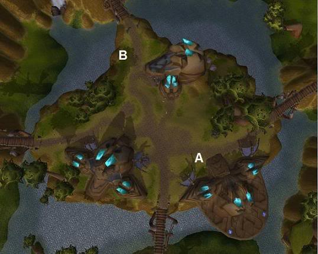

--- VERTICAL SLIDE ---

### A waypoint graph

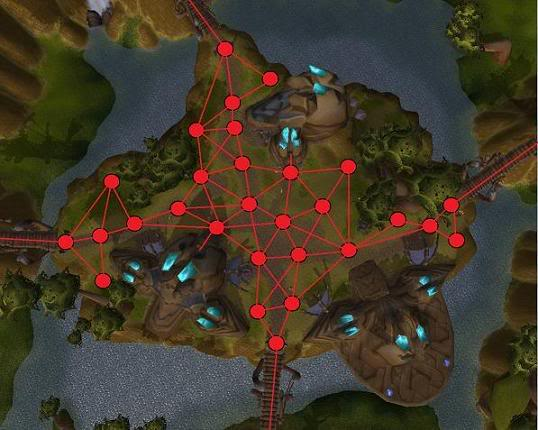

--- VERTICAL SLIDE ---

## Solving pathfinding

1. Apply any graph-searching algorithm
2. Find your destination
3. ???
4. Profit

--- VERTICAL SLIDE ---


--- VERTICAL SLIDE ---

## A*

* Guided BFS
* The only viable choice (Djikstra's may be better
in some cases)
* Expand nodes based on distance AND a heuristic

--- VERTICAL SLIDE ---

* Will always find the optimal solution in the minimal number
of steps required if one exists
    - if given an admissible heuristic
* An admissible heuristic never overestimates the actual distance
between two nodes

--- VERTICAL SLIDE ---

```cpp
function AStar(start, goal, heuristic)
    visited = []
    frontier = [start]
    parents = empty_map()
    gScore = map_defaulting_to_infinity()
    gScore[start] = 0
    fScore = map_defaulting_to_infinity()
    fScore[start] = heuristic(start, goal)

    while frontier is not empty
        result = updateSearchStructures(visited, ...)
        if result is success
            return result
    return failure
```

--- VERTICAL SLIDE ---

```cpp
function updateSearchStructures()
    current = argmin(frontier, fScore)
    if current is goal
        return reconstruct_path(goal, parents)

    frontier.remove(current)
    visited.add(current)
    foreach neighbour in current.neighbours
        if neighbour is in visited
            continue
        currentGScore = gScore[current] + distance(current, neighbour)
        if neighbour is not in frontier
            frontier.add(neighbour)
        else if currentGScore >= gScore[current]
            continue

        parents[neighbour] = current
        gScore[neighbour] = currentGScore
        fScore[neighbour] = currentGScore + heuristic(neighbour, goal)
```

--- VERTICAL SLIDE ---


--- VERTICAL SLIDE ---

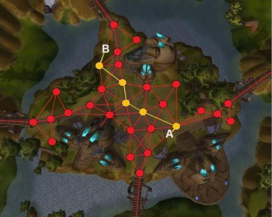

--- VERTICAL SLIDE ---

## Variants

* Memory-bounded A*
* Hierarchial A*
    - Running a hundred A* on a huge level is not going to cut it

--- NEXT SLIDE ---

## Representing the world 2.0

Way-point graphs give low amount of information
and make movement look like on rails.

#### Enter navigation meshes

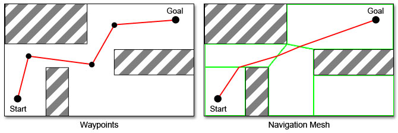

--- VERTICAL SLIDE ---


--- VERTICAL SLIDE ---

### Nav meshes advantages

* No rails
* No zig-zags
* Works for all unit types
* Greatly improves performance
* Can do path computation (smoothing, simplification)
* Can be automatically generated
* ...while still being able to be manually edited
* Not a single commercial engine uses anything but nav meshes
* [Click me for more advantages](http://www.cs.uu.nl/docs/vakken/mpp/other/path_planning_fails.pdf)

--- VERTICAL SLIDE ---

### Basic nav mesh searching

1. Run HPA* on each level of granularity
2. Remove unnecessary polygons from the path
    - if x -> y -> z and the path from x to z is clear,
    remove y from the path
3. Smooth
    - for each angle caused by a change of direction
        - apply a besier curve to smooth it

--- VERTICAL SLIDE ---

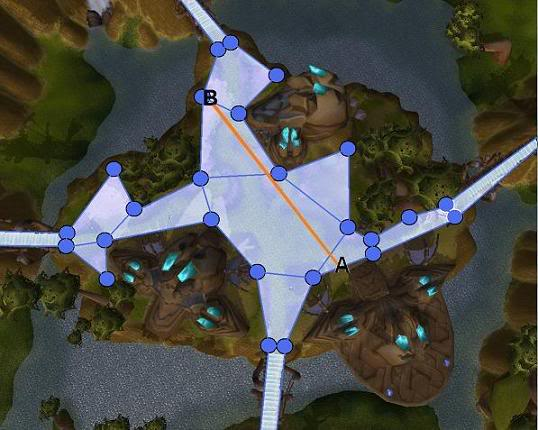

--- VERTICAL SLIDE ---

## [Recast & Detour](https://github.com/recastnavigation/recastnavigation)

You don't have to implement nav meshes and pathfinding by yourself!

--- NEXT SLIDE ---

## Obstacle avoidance

* Static obstacles are easy - mark them in the nav mesh!
* Dynamic obstacles problems
    - Two actors taking the same path
    - Actor getting stuck due to insufficient space
    - Destructible items' debris make the situation even better

--- VERTICAL SLIDE ---

<iframe width="560" height="315" src="https://www.youtube.com/embed/qiGhXWG-Q0Q" frameborder="0" allowfullscreen></iframe>

--- VERTICAL SLIDE ---

## Some dynamic avoidance solutions

* Include spatial information in A*
* Lock paths - whenever an actor starts moving
at a given path, block other actors from having it

--- VERTICAL SLIDE ---

## Some dynamic avoidance solutions

* Raycast & recompute - raycast ahead of the character and if
an obstacles is hit, recompute the current path at the local level.
* Synchronize paths - nearby actors don't compute
their paths indepedently; instead, a higher-level entity generates them
so that no two are the same

--- NEXT SLIDE ---

## Steering

* Steering algorithms are higher-level decision
about how to move
* They are often reused and converted into libraries
* Examples
    - seek
    - arrive
    - wander
    - flee
    - chase & evade
    - interpose
    - hide

--- VERTICAL SLIDE ---

```
function seek(agent, goal)
    agent.walkTowards(computePath(agent.position, goal))

function arrive(agent, goal)
    agent.decelerateTowards(computePath(agent.position, goal))

function chase(agent, enemy)
    seek(agent, predictEnemyPosition(enemy, timeDistance(agent, enemy))))
```

--- NEXT SLIDE ---

## Decision-making

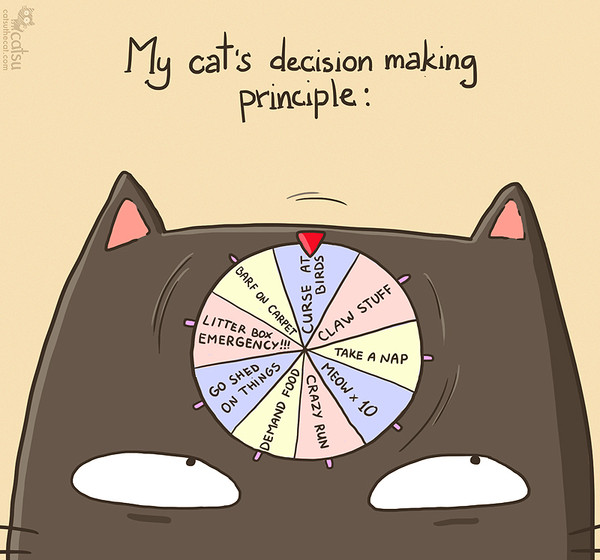

--- VERTICAL SLIDE ---

### Types of agents (as defined by general-purpose AI)

* Reflex agents
* Model-based agents
* Goal-based agents
* Utility-based agents

--- NEXT SLIDE ---

## Behaviour (decision) trees

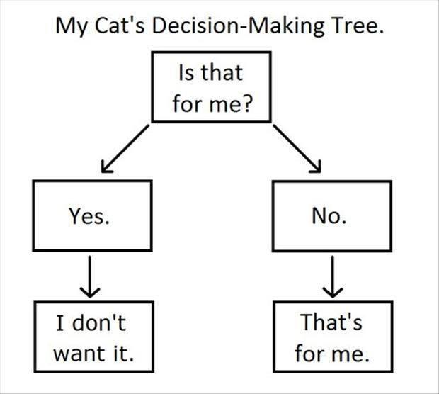

--- VERTICAL SLIDE ---

## Behaviour (decision) trees

* The simplest form of decision-making algorithm
* Learnable
* Readable - If X then Y

--- VERTICAL SLIDE ---

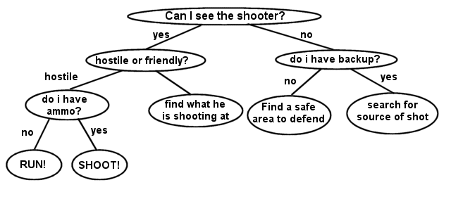

--- VERTICAL SLIDE ---

## State machines

Looping decision trees


--- VERTICAL SLIDE ---

State machines are very powerful, yet it is really easy to miss cases

<video autoplay loop src="resources/17.ai/scripted_ai.mp4">
</video>

--- NEXT SLIDE ---

## Fuzzy logic

Fuzzy logic is a theory equivalent to probability theory but
with different semantics

* Object **X** is in set **A** with a degree of membership **p**
    - Compare to there's a **p** chance **X** is in **A**

--- VERTICAL SLIDE ---

### Fuzzy logic

* Fuzzy logic depends on the agent's beliefs
* *That level 50 monster is dangerous*
    - Dangerous is a fuzzy qualifier
    - Dangerous for lvl 10 != Dangerous for lvl 100
* Make a decision tree for the statement 'If the monster is dangerous, then move
far away and attack at range'

--- VERTICAL SLIDE ---

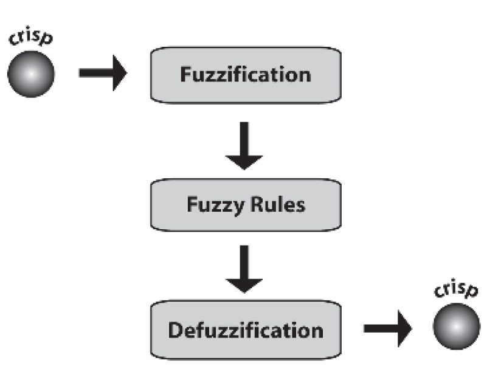

--- VERTICAL SLIDE ---

### Fuzzification

* *Crisp* sets are standard sets - something's either in or not
    - Crisp values are absolute values - 'he's 1.80m high'
* *Fuzzy* sets attach a degree of membership to any object in the universe
* Fuzzification is the process of converting crisp values to fuzzy
* Usually done with predefined member functions
    - triangular
    - shoulder
    - trapezoid
    - bell

--- VERTICAL SLIDE ---


--- VERTICAL SLIDE ---

### Fuzzy set operation

$$
A \cup B = max(A, B) \\\\
A \cap B = min(A, B) \\\\
Very(A) = A^2 \\\\
Fairly(A) = \sqrt A
$$
```
if Dangerous(Monster) and FarAway(Distance) then Desirable(Attack)
if Dangerous(Monster) or Close(Distance) then Undesirable(Attack)
// is equivalent to
Desirable(Attack) = Min(Dangerous(Monster), FarAway(Distance))
Undesirable(Attack) = Max(Dangerous(Monster), FarAway(Distance))
```

--- VERTICAL SLIDE ---

### Defuzzification

* Compute all of the resultant sets
* Use one of the few magical methods to convert back to crisp value
* Applications:
    - Compute the desireability for each of several actions in order
    to decide which one to use
        - e.g. what's the best weapon to use now?
    - Fuzzify your behaviour tree

--- VERTICAL SLIDE ---

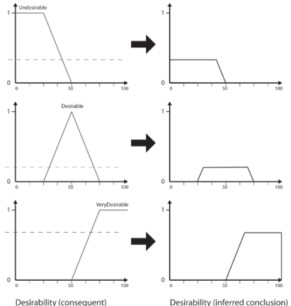

--- VERTICAL SLIDE ---

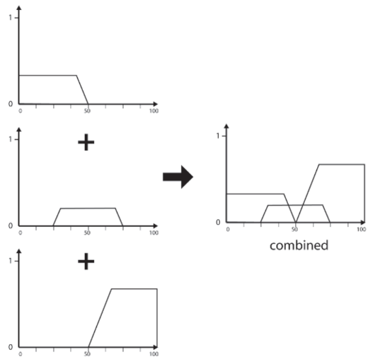

--- NEXT SLIDE ---

## Goal-driven

* Give the agent some goals to follow
* Structured in a hierarchy
* Often stored in libraries
* Promotes reusability

```
Kill-enemy-task
    Get-weapon
    Get-in-position
    Shoot
    Check-condition
```

* It helps to flatten the hierarchy in a queue

--- VERTICAL SLIDE ---

## Monte carlo tree search

* Play a game N times
* Record good moves / sequences of moves
* Replay them with some probability

--- NEXT SLIDE ---

## Utility-driven

```
function decide(agent)
    bestUtility = 0
    bestAction = null
    for action in agent.actions
        futureWorld = projectAction(currentWorld, action)
        futureUtility = utility(futureWorld)
        if futureUtility > bestUtility
            bestUtility = utility
            bestAction = action
```

--- NEXT SLIDE ---

## Group behaviour / flocking


--- NEXT SLIDE ---

## Machine-learning applications / content generation

* Give the learner a list of good levels / creatures / items
* Have it generate more! Tadaaa, infinite content!
* Ubisoft's and CD Project Red's talks at GDC 2016


--- NEXT SLIDE ---

Questions?

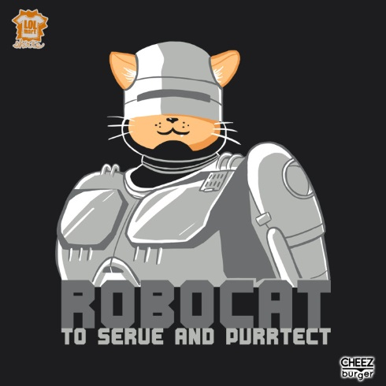